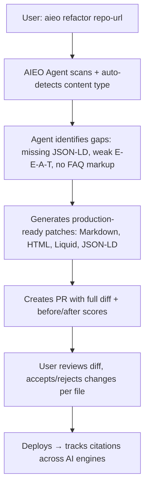

# PRD.md  
**PRD: AIEO Studio – AI Engine Optimization Platform (AIEO 2.0)**  
**Product Name:** AIEO Studio  
**File:** PRD.md  
**Status:** Living | Version: 2026-03-28 v2.0  
**Author:** Built from AIEO open-source foundation + zer0-mistakes.com case study

---

## Document Control

| Role | Name | Approval Status |
|------|------|-----------------|
| Product Owner | TBD | ☐ Pending |
| Technical Lead | TBD | ☐ Pending |
| Design Lead | TBD | ☐ Pending |
| Business Stakeholder | TBD | ☐ Pending |

---

## Table of Contents

0. [Executive Summary](#0-executive-summary)
1. [WHY (Problem Statement)](#1-why-problem-statement)
2. [MVP (Minimum Viable Promise)](#2-mvp-minimum-viable-promise)
3. [UX (User Experience Flow)](#3-ux-user-experience-flow)
4. [API (Atomic Programmable Interface)](#4-api-atomic-programmable-interface)
5. [NFR (Non-Functional Realities)](#5-nfr-non-functional-realities)
6. [EDGE (Exceptions, Dependencies, Gotchas)](#6-edge-exceptions-dependencies-gotchas)
7. [OOS (Out Of Scope)](#7-oos-out-of-scope--deliberate)
8. [Technical Architecture](#8-technical-architecture)
9. [AIEO Patterns & Techniques](#9-aieo-patterns--techniques)
10. [User Stories](#10-user-stories)
11. [Data Models](#11-data-models)
12. [Integration Points](#12-integration-points)
13. [Testing & Validation](#13-testing--validation)
14. [Go-To-Market](#14-go-to-market)
15. [Security & Privacy](#15-security--privacy)
16. [Roadmap](#16-roadmap)
17. [Risks](#17-risks-top-10)
18. [Success Criteria](#18-success-criteria-definition-of-done)
19. [Appendix](#19-appendix)
20. [Next Steps](#20-next-steps)

---

## 0. Executive Summary

AIEO Studio is the first **full-cycle AI-native website optimization platform** that combines traditional SEO with next-generation **Answer Engine Optimization (AEO)**. It goes far beyond scoring: it actively **refactors** any website (Jekyll, Hugo, Next.js, WordPress, or static HTML) into content that modern AI engines (ChatGPT, Claude, Grok, Gemini, Perplexity, Google AI Overviews) can parse, trust, and cite at the highest level.

Built on the open-source AIEO engine (prompt-driven scoring + MCP tools), AIEO Studio adds an intelligent refactoring layer powered by GitHub Copilot-style agents. Using zer0-mistakes.com as the reference implementation, it delivers production-ready patches, JSON-LD schemas, FAQ sections, E-E-A-T signals, and more — all while preserving the site's original design and functionality.

### Core Value Proposition

> Turn any website from "Google-friendly" into "AI-first" in minutes, delivering measurable lifts in both classic SEO rankings **and** AI citation rates.

---

## 1. WHY (Problem Statement)

### The Shift
Search engines are no longer the primary discovery layer — **AI answer engines are**.  
Traditional SEO (keywords, backlinks, meta tags) produces content that AI models often ignore, fail to parse, or distrust.

Current AEO tools are either shallow checklists or expensive black-box services with no refactoring output. Developers and content teams lack a single tool that audits **and** automatically improves both technical parseability (schema, structured data) and contextual citability (entities, FAQs, temporal anchoring, substantiated claims).

**Example:** zer0-mistakes.com (v0.19.1) is already an excellent Jekyll theme site, yet it scores ~88/100 on AIEO because it lacks JSON-LD, author schema, FAQPage markup, and citation hooks for its 95% success-rate claim. Without AIEO Studio, creators lose visibility in the 65%+ of searches that now end in zero-click AI answers.

AIEO Studio is the disciplined practice of manufacturing content realities that AI engines preferentially surface, cite, synthesize, and recommend — turning prompts into traffic.  

### Key Hypothesis
> Content optimized with AIEO Studio achieves ≥ 3–5× higher citation rate in top AI engine responses vs. classic SEO content, while simultaneously improving traditional SEO metrics by 30–50%.

**Validation Plan:** Controlled A/B test with 100 articles, 30-day measurement window, statistical significance p < 0.01.

### Business Goals
- Become the de-facto standard tool for AEO/GEO (Generative Engine Optimization).
- Achieve 10,000 active repositories/websites optimized within 12 months.
- Drive adoption of the open-source AIEO core.

### Product Goals
- Improve traditional SEO metrics (organic traffic, click-through rate, rankings) by 30–50%.
- Increase AI citation frequency by 3–5× (measured via Perplexity, Claude, Grok, Google AI Overviews).
- Reduce time-to-optimize from weeks to <30 minutes.

### User Goals
- **Non-technical users:** Get instant, actionable reports + one-click apply.
- **Developers:** Receive Git-ready diffs and Copilot-agent integration.
- **Agencies:** Batch-optimize client sites with ROI tracking.

### Market Context

| Signal | Data Point | Source |
|--------|------------|--------|
| AI adoption | 60%+ knowledge workers use AI engines daily | *[To be validated: Industry survey 2025]* |
| Traffic shift | 15-25% decline in organic search clicks YoY for info queries | *[To be validated: Web analytics aggregates]* |
| Zero-click answers | 65%+ of searches end in zero-click AI answers | *[To be validated: Citation tracking 2026]* |
| Creator pain | Content creators reporting 40% visibility loss | *[To be validated: User interviews]* |
| Timing | First-mover advantage window: 12-18 months | *[Estimate based on SEO adoption curves]* |

### Competitive Landscape

| Competitor | Focus | AIEO Studio Differentiation |
|------------|-------|----------------------|
| Clearscope, Surfer SEO | Traditional SEO optimization | AI-native + refactoring engine, not Google-focused |
| Jasper, Copy.ai | AI content generation | Optimization + refactoring, not generation |
| Semrush, Ahrefs | SEO analytics | AI citation tracking + production-ready patches |
| *Shallow AEO checklists* | Score-only, no refactoring | Full-cycle: audit → refactor → PR → deploy |
| *No direct competitor* | — | First full-cycle AEO/GEO platform with refactoring |

### Assumptions
1. AI engines will continue to grow as discovery mechanisms (not a fad)
2. AI engines have discoverable citation preferences (patterns exist)
3. Content optimization can influence citations without manipulation
4. Users will pay for citation optimization tooling
5. Users have GitHub access for PR creation (fallback: downloadable patch)
6. JSON-LD and structured data improve AI parseability measurably

---

## 2. MVP (Minimum Viable Promise)

### Core User Personas

| Persona | Who | Pain Point | Jobs to Be Done |
|---------|-----|------------|-----------------|
| **Indie Developer** | Creator of Jekyll/Hugo themes, personal sites | Manual schema & FAQ work, invisible to AI | One-click refactor of personal site |
| **Content Agency PM** | Manages 50+ client sites | Inconsistent AEO across projects | Batch audits + exportable reports |
| **SEO Specialist** | Enterprise SEO team | AI Overviews ignoring their content | Deep pattern analysis + schema generation |
| **Open-Source Maintainer** | zer0-mistakes style projects | Want to showcase AI-readiness | Auto-PR generation for AIEO badges |
| **Content Creator** | Bloggers, newsletter writers, documentation authors | "My content doesn't appear in AI answers" | Audit content, apply optimizations, track results |
| **Publisher** | Media companies, SaaS docs teams, knowledge bases | "Competitors get cited, we don't" | Batch optimize, monitor citations, scale AIEO |

### Feature Prioritization (MoSCoW)

| Priority | Feature | Description | Rationale |
|----------|---------|-------------|-----------|
| **P0: Must Have** | Universal Auditor | `aieo_audit_url` + `aieo_score_content` with content-type auto-detection (landing page, docs, Jekyll theme, product page) + hybrid scoring (full AI + fast heuristic fallback) | Core value prop, validates product |
| **P0: Must Have** | Intelligent Refactor Agent | Generates production-ready diffs/patches (Markdown, HTML, Liquid, JSON-LD). Auto-creates: JSON-LD schemas, FAQ sections, Author/E-E-A-T bios, glossary definitions, substantiated claims, comparison tables, procedural steps | Core differentiator vs. score-only tools |
| **P0: Must Have** | Scoring engine | Pattern-based scoring rubric (10 original + 6 new AEO patterns) with editable Markdown weights | Foundation for audit/refactor |
| **P0: Must Have** | GitHub / Copilot Integration | One-click "Apply Refactor" → creates PR with full diff. Native MCP server for VS Code Copilot, Claude Desktop, Cursor. "Refactor this repo" command | Developer-first workflow |
| **P1: Should Have** | SEO + AEO Dashboard | Before/after scores (traditional SEO + AIEO). Preview of refactored page as seen by Claude/Grok. Lighthouse, schema validator, AI citation simulator | Proves ROI, drives retention |
| **P1: Should Have** | Pattern library | 16+ proven AIEO patterns with examples (10 original + 6 new AEO-specific) | Enables learning, templates |
| **P1: Should Have** | Web UI | Dashboard + audit + refactor interface | Expands TAM beyond CLI users |
| **P2: Could Have** | Batch processing | Process sitemap/folder at once with site crawler | Scales for publishers & agencies |
| **P2: Could Have** | Webhook alerts | Citation drop notifications | Engagement hook |
| **P3: Won't Have (v1)** | Mobile app | iOS/Android app | Low priority for creators |
| **P3: Won't Have (v1)** | Multi-language | Non-English support | Complexity for MVP |
| **P3: Won't Have (v1)** | Team features | Collaboration, shared access | Enterprise-focused |

### MVP Success Criteria
- [ ] Audit returns actionable score in <60 seconds for typical landing page
- [ ] Refactor produces measurable score uplift (avg +35 points)
- [ ] 100 beta users complete audit → refactor → PR → publish workflow
- [ ] 70% of audited sites apply at least one refactor
- [ ] 50% of optimized content shows citation improvement within 30 days
- [ ] zer0-mistakes.com achieves 98+/100 AIEO score as public benchmark

### Technical Constraints
- Must work offline for markdown files (online for URL fetch + citation tracking)
- CLI must run on macOS, Linux, Windows
- Compatibility with any static-site generator: full Jekyll support at launch, Hugo/Next.js/WordPress planned
- Audit + refactor < 60 seconds for typical landing page
- API response time P99 < 15 seconds
- Max input: 50,000 words per document
- All generated content meets WCAG 2.2 AA  

---

## 3. UX (User eXperience Flow)

**Primary Flow: Refactor Content**


```mermaid
graph TD
    A[User: aieo refactor repo-url] --> B[AIEO Agent scans + auto-detects content type]
    B --> C[Agent identifies gaps: missing JSON-LD, weak E-E-A-T, no FAQ markup]
    C --> D[Generates production-ready patches: Markdown, HTML, Liquid, JSON-LD]
    D --> E[Creates PR with full diff + before/after scores]
    E --> F[User reviews diff, accepts/rejects changes per file]
    F --> G[Deploys → tracks citations across AI engines]
```

**Secondary Flows:**

**Flow 3A: Audit Existing Content**
1. User runs `aieo audit https://example.com/article`
2. System fetches content, auto-detects content type (landing page, docs, Jekyll theme, product page)
3. Hybrid scoring: Full AI (OpenAI/Anthropic) + fast heuristic fallback
4. Returns scorecard: score (0-100), gap analysis, prioritized fixes
5. User reviews gaps, clicks "Apply Refactor" → Flow 3B

**Flow 3B: One-Click Refactor → PR**
1. User clicks "Apply Refactor" or runs `aieo refactor <repo-url>`
2. Intelligent Refactor Agent generates exact, production-ready diffs/patches
3. Auto-creates: JSON-LD schemas, FAQ sections, Author/E-E-A-T bios, substantiated claims
4. Creates GitHub PR with full diff view
5. User reviews, accepts/rejects individual changes

**Flow 3C: Batch Optimization**
1. User uploads folder of markdown files, provides sitemap, or connects site crawler
2. System processes in parallel (rate-limited per engine)
3. Returns batch report: refactored files + aggregate score uplift
4. User reviews diff view, accepts/rejects changes per file

**Flow 3D: Monitor Citations**
1. User connects domain/topics in dashboard
2. System continuously probes AI engines with relevant prompts
3. Dashboard shows: citation rate over time, which engines cite most, top-cited pages
4. Alerts when citation rate drops → suggests re-optimization

**Flow 3E: MCP Agent Integration**
1. Developer calls `aieo_refactor_content` via MCP from VS Code Copilot, Claude Desktop, or Cursor
2. Agent receives repo context and executes refactoring prompt
3. Returns patch file with production-ready changes
4. Developer reviews inline in editor

**Key UX Principles:**
- **Speed**: Audit + refactor <60s for typical landing page (show progress bar with ETA)
- **Transparency**: Always show "why" behind each optimization (hover tooltips)
- **Control**: Users can accept/reject individual changes (diff view, PR review)
- **Preservation**: Refactoring preserves original site design and functionality
- **Learning**: Dashboard teaches users AIEO patterns over time

---

## 4. API (Atomic Programmable Interface)

**Base URL:** `https://api.aieo.dev/v1`

### Endpoints

| Endpoint                  | Method | Description |
|---------------------------|--------|-------------|
| `/aieo/audit`             | POST   | Audit content for AIEO score (hybrid: AI + heuristic) |
| `/aieo/refactor`          | POST   | Refactor content with production-ready patches |
| `/aieo/optimize`          | POST   | Optimize content with AIEO patterns (legacy) |
| `/aieo/dashboard`         | GET    | Get share-of-voice metrics (SEO + AEO) |
| `/aieo/citations`         | GET    | List citations for URL/domain |
| `/aieo/patterns`          | GET    | Browse pattern library (16+ patterns) |
| `/aieo/patterns/{id}/apply` | POST | Apply pattern to content |
| `/aieo/batch`             | POST   | Queue batch processing job |
| `/aieo/batch/{job_id}`    | GET    | Get batch job status |
| `/aieo/schema/generate`   | POST   | Generate JSON-LD schema for content |
| `/aieo/health`            | GET    | System health check |

### MCP Tools (Native Integration)

| Tool | Description |
|------|-------------|
| `aieo_audit_url` | Audit a URL for AIEO score |
| `aieo_score_content` | Score raw content against AIEO rubric |
| `aieo_refactor_content` | Generate production-ready refactoring patches |
| `aieo_generate_schema` | Generate JSON-LD schema for content |

### Request/Response Examples

**POST `/aieo/audit`**
```json
// Request
{
  "url": "https://example.com/article",  // OR
  "content": "# My Article\n...",         // one of url/content required
  "format": "markdown"                    // markdown | html
}

// Response (200 OK)
{
  "score": 67,
  "grade": "C+",
  "gaps": [
    {
      "id": "gap_001",
      "category": "structure",
      "severity": "high",
      "description": "No comparison tables found",
      "location": { "start": 0, "end": 500 },
      "example_fix": "Add comparison table for X vs Y"
    }
  ],
  "fixes": [...],
  "benchmark": {
    "percentile": 45,
    "engine_scores": { "grok": 72, "claude": 65, "gpt": 64 }
  }
}
```

**POST `/aieo/optimize`**
```json
// Request
{
  "content": "# My Article\nThis is about...",
  "target_engines": ["grok", "claude", "gpt"],  // optional, default: all
  "style": "preserve"                            // preserve | aggressive
}

// Response (200 OK)
{
  "optimized_content": "# My Article\n\n**Updated December 2025**\n...",
  "score_before": 45,
  "score_after": 78,
  "uplift": 33,
  "changes": [
    {
      "type": "inject",
      "description": "Added temporal anchor",
      "location": { "start": 15, "end": 15 },
      "original_text": "",
      "optimized_text": "**Updated December 2025**",
      "expected_uplift": 8
    }
  ]
}
```

### Error Responses

| Status Code | Error Code | Description |
|-------------|------------|-------------|
| 400 | `INVALID_REQUEST` | Missing required fields or invalid format |
| 401 | `UNAUTHORIZED` | Invalid or missing API key |
| 403 | `RATE_LIMITED` | Rate limit exceeded |
| 404 | `NOT_FOUND` | Resource not found |
| 413 | `CONTENT_TOO_LARGE` | Content exceeds 50,000 word limit |
| 422 | `FETCH_FAILED` | Unable to fetch URL content |
| 500 | `INTERNAL_ERROR` | Server error |
| 503 | `ENGINE_UNAVAILABLE` | AI engine(s) temporarily unavailable |

```json
// Error response format
{
  "error": {
    "code": "RATE_LIMITED",
    "message": "Rate limit exceeded. Retry after 60 seconds.",
    "retry_after": 60
  }
}
```

### Pagination

List endpoints support cursor-based pagination:

```json
// Request
GET /aieo/citations?url=example.com&limit=50&cursor=abc123

// Response
{
  "data": [...],
  "pagination": {
    "next_cursor": "def456",
    "has_more": true,
    "total_count": 150
  }
}
```

### Authentication & Rate Limits

| Header | Format | Required |
|--------|--------|----------|
| `Authorization` | `Bearer <api_key>` | Yes |
| `X-Request-Id` | UUID | Recommended (for debugging) |

| Plan | Rate Limit | Burst Limit |
|------|------------|-------------|
| Free | 100 req/hour | 10 req/minute |
| Pro | 1,000 req/hour | 50 req/minute |
| Enterprise | Unlimited | Custom |

### Webhooks

```json
// Citation alert webhook payload (POST to user-configured URL)
{
  "event": "citation.detected",
  "timestamp": "2025-12-28T10:30:00Z",
  "data": {
    "url": "https://example.com/article",
    "engine": "claude",
    "prompt": "Compare X and Y",
    "citation_text": "According to example.com...",
    "position": 1
  }
}
```

### Versioning

- API versioned via URL path (`/v1/`, `/v2/`)
- Breaking changes → new major version
- Deprecation notice: 6 months before removal
- Current: `v1` (stable), no planned deprecations

---

## 5. NFR (Non-Functional Realities)

### Performance

| Metric | Target | Measurement |
|--------|--------|-------------|
| Audit latency | P50 < 15s, P99 < 60s (typical landing page) | APM monitoring |
| Refactor latency | P50 < 30s, P99 < 60s (typical landing page) | APM monitoring |
| Dashboard load | < 2s initial, < 500ms refresh | RUM |
| API throughput | 1,000 concurrent audits | Load testing |
| Batch processing | 100 pages/minute | Job queue metrics |

### Reliability

| Metric | Target | Measurement |
|--------|--------|-------------|
| Uptime | 99.9% (8.76 hours/year downtime) | Uptime monitoring |
| Error rate | < 0.1% of requests | Error tracking |
| Data durability | 99.999999999% (11 nines) | Cloud storage SLA |
| MTTR | < 1 hour for P1 incidents | Incident tracking |
| RTO | < 4 hours | Disaster recovery drills |
| RPO | < 1 hour | Backup frequency |

### Accuracy

| Metric | Target | Measurement |
|--------|--------|-------------|
| Score-to-citation correlation | ≥ 0.92 Pearson coefficient | Monthly validation |
| Pattern effectiveness | ≥ 80% of patterns show measurable uplift | A/B testing |
| False positive rate | < 5% of gap detections | Manual sampling |
| Citation detection accuracy | ≥ 95% precision, ≥ 90% recall | Ground truth comparison |

### Scalability

| Metric | Target | Measurement |
|--------|--------|-------------|
| Concurrent users | 10,000 simultaneous | Load testing |
| Content size | Up to 50,000 words per document | Integration tests |
| Batch size | Up to 1,000 URLs per batch | Stress testing |
| Database size | 100M+ citations, 10M+ audits | Capacity planning |
| Engine coverage | 6 AI engines, expandable architecture | Integration tests |

### Cost Efficiency

| Metric | Target | Measurement |
|--------|--------|-------------|
| Cost per audit | ≤ $0.02 | Cost monitoring |
| Cost per optimization | ≤ $0.05 | Cost monitoring |
| Cost per citation probe | ≤ $0.001 | Cost monitoring |
| Infrastructure per 1K users | ≤ $500/month | Cloud billing |

### Security & Privacy

| Requirement | Implementation | Compliance |
|-------------|----------------|------------|
| Encryption at rest | AES-256 | SOC 2, GDPR |
| Encryption in transit | TLS 1.3 | SOC 2, PCI |
| Data retention | User-controlled (0-90 days) | GDPR Art. 17 |
| Access logging | All API access logged | SOC 2 |
| Vulnerability scanning | Weekly automated scans | SOC 2 |
| Penetration testing | Annual third-party | SOC 2 |

### Accessibility

| Requirement | Implementation | Compliance |
|-------------|----------------|------------|
| Generated content | All AIEO-generated content meets WCAG 2.2 AA | WCAG 2.2 |
| Dashboard UI | Keyboard navigable, screen reader compatible | WCAG 2.2 AA |
| Color contrast | All UI elements meet 4.5:1 contrast ratio | WCAG 2.2 AA |

### Privacy

| Requirement | Implementation | Compliance |
|-------------|----------------|------------|
| Consent management | PostHog-style consent built in | GDPR, CCPA |
| Data storage | No content stored without explicit consent | GDPR Art. 7 |
| Right to deletion | One-click account + data deletion | GDPR Art. 17 |
| Data portability | Export all user data in JSON format | GDPR Art. 20 |

---

## 6. EDGE (Exceptions, Dependencies, Gotchas)

### Dependencies

| Dependency | Type | Risk Level | Mitigation |
|------------|------|------------|------------|
| AI engine APIs | External | High | Multi-engine support, fallback logic |
| OpenAI/Anthropic (for optimization) | External | Medium | Heuristic fallback + usage tiers |
| Citation detection | External | High | Ensemble detection (APIs + probing + partnerships) |
| GitHub API (PR creation) | External | Low | Downloadable patch fallback |
| Schema.org validation | External | Low | Bundled templates, offline validation |
| MCP protocol | External | Medium | Standard protocol, multiple client support |
| Vector database (Qdrant) | Infrastructure | Medium | Self-hosted Qdrant as default |
| Cloud infrastructure (Docker/K8s) | Infrastructure | Low | Docker Compose for local, K8s for cloud |

### Edge Cases

| Scenario | Expected Behavior | Test Case |
|----------|-------------------|-----------|
| URL returns 404 | Return error `FETCH_FAILED` with helpful message | `test_audit_404` |
| Content in unsupported language | Return error with language detected, suggest English | `test_non_english` |
| Extremely long content (>50K words) | Return error `CONTENT_TOO_LARGE`, suggest splitting | `test_large_content` |
| Content with heavy JavaScript rendering | Attempt headless fetch, warn if JS-dependent | `test_spa_content` |
| Paywall/login-protected content | Return error, suggest manual paste | `test_paywall` |
| AI engine temporarily unavailable | Graceful degradation, partial results | `test_engine_down` |
| User submits copyrighted content | Process (we don't judge content), ToS covers liability | `test_copyright` |
| Optimization makes content worse | Rollback mechanism, user can reject | `test_negative_uplift` |
| Rate limit during batch job | Queue backpressure, resume from checkpoint | `test_batch_rate_limit` |

### Gotchas & Anti-Patterns

| Issue | Description | Prevention |
|-------|-------------|------------|
| Over-optimization | AI engines may detect and downrank formulaic content | "Natural variation" mode injects randomness; built-in anti-pattern penalties |
| Keyword stuffing | Legacy SEO patterns harm AIEO scores | Anti-pattern detection, score penalty |
| False attribution | Making up citations/sources | Fact-checking layer (v2), source validation |
| Style destruction | Aggressive optimization loses author voice | "Preserve style" mode, diff approval |
| Citation gaming | Probing AI engines could trigger rate limits | Respect ToS, distributed probing |
| LLM cost overruns | Large sites with many pages generate high API costs | Heuristic fallback scoring, caching, usage tiers |
| Schema bloat | Excessive JSON-LD can slow page load | Minification, only add relevant schemas |

### Known Limitations (v1)

| Limitation | Workaround | Planned Fix |
|------------|------------|-------------|
| English only | No workaround | v1.5: Multi-language |
| Text only | No workaround | v2: Images, video |
| No real-time probing | Manual refresh | v2: Streaming updates |
| Single-user accounts | Share API key | v2: Team accounts |

### Ethical Boundaries

> **Principle:** AIEO optimizes for truth + discoverability, not deception.

| ✅ Allowed | ❌ Not Allowed |
|-----------|---------------|
| Improving structure for clarity | Fabricating facts/statistics |
| Adding valid source citations | Creating fake citations |
| Temporal anchoring with real dates | Misleading freshness signals |
| Entity enrichment with accurate info | Injecting false entities |
| Pattern optimization for discoverability | Manipulating to spread misinformation |  

---

## 7. OOS (Out Of Scope – Deliberate)

| Exclusion | Rationale | Future Consideration |
|-----------|-----------|---------------------|
| Black-hat manipulation | Ethical boundary, long-term risk | Never |
| Social media optimization | Different discovery mechanism | v2.0+ |
| Video/audio content | Complexity, text-first validation | v1.5 (alt text), v2.0 (full) |
| Real-time content injection | Infrastructure complexity | v2.0 |
| Multi-language support | MVP scope, validation first | v1.5 |
| Mobile app | Low priority for target persona | v1.5+ |
| Custom AI engine support | Prioritize top 6 first | v1.5 |
| On-prem / self-hosted deployment | Enterprise complexity | v2.0 / 2027 |
| SSO / enterprise identity | Enterprise complexity | 2027 |
| Custom pattern marketplace | Community infrastructure needed | 2027 |

> **Note:** Traditional Google SEO is now **in scope** — AIEO Studio is a hybrid SEO+AEO platform. Static-site generator support (Jekyll, Hugo, Next.js) is also in scope for MVP.

---

## 8. TECHNICAL ARCHITECTURE

**System Components:**

```
┌─────────────────┐     ┌──────────────┐     ┌─────────────┐
│ CLI / Web UI /  │────▶│  API Gateway │────▶│  Core API   │
│ MCP Clients     │     └──────────────┘     └─────────────┘
│ (VS Code,       │                                │
│  Claude Desktop,│     ┌──────────────────────────┼─────────────────────────┐
│  Cursor)        │     │              │           │                         │
└─────────────────┘     │        ┌─────▼─────┐ ┌───▼───────┐     ┌─────────▼──────┐
                        │        │  Audit    │ │ Refactor  │     │  Citation      │
                        │        │  Engine   │ │ Agent     │     │  Tracker       │
                        │        └─────┬─────┘ └───┬───────┘     └───────┬────────┘
                        │              │           │                     │
                        │        ┌─────▼───────────▼─────────────────────▼────────┐
                        │        │              AI Engine Probers                 │
                        │        │ (Grok, GPT-4, Claude, Gemini, Perplexity,     │
                        │        │  Google AI Overviews)                          │
                        │        └───────────────────────────────────────────────┘
                        │              │
                        │        ┌─────▼──────────────────────────┐
                        │        │  Schema Generation Engine      │
                        │        │  (JSON-LD, FAQPage, HowTo,    │
                        │        │   Author, SoftwareApplication) │
                        │        └────────────────────────────────┘
                        │              │
                        │        ┌─────▼─────┐    ┌──────────────┐
                        │        │  Vector   │    │  GitHub      │
                        │        │  Database │    │  Integration │
                        │        │ (Qdrant)  │    │  (PR/Diff)   │
                        └────────┴───────────┘    └──────────────┘
```

**Tech Stack:**
- **Core**: Extend existing open-source AIEO (FastAPI backend + React frontend)
- **Refactor Engine**: LLM-orchestrated agent using Copilot-style prompt engineering
- **Schema Generation**: Powered by validated schema.org templates + real-time validation
- **MCP Server**: First-class support for Claude Desktop, VS Code Copilot, Windsurf, Cursor
- **AI/ML**: OpenAI GPT-4, Anthropic Claude (for optimization), LangChain (orchestration)
- **Vector DB**: Qdrant for pattern matching and citation tracking (Pinecone optional)
- **Queue**: Redis + Celery for batch jobs
- **Database**: SQLite for personal use; PostgreSQL + S3 for cloud; TimescaleDB (citation metrics)
- **Cache**: Redis (frequent audit results, engine responses)
- **Infrastructure**: Docker Compose + one-click GitHub App; Kubernetes (GKE/EKS) for cloud
- **Monitoring**: Prometheus + Grafana, Sentry (errors)

**Data Flow:**
1. User submits content (URL, repo, or raw content) → API validates → enqueues job
2. Audit engine: fetches content, auto-detects content type, scores against rubric (hybrid AI + heuristic)
3. Refactor agent: identifies gaps, generates production-ready patches (JSON-LD, FAQ, E-E-A-T, etc.)
4. Schema generation: creates validated JSON-LD schemas (SoftwareApplication, WebPage, FAQPage, HowTo, Author)
5. GitHub integration: creates PR with full diff and before/after score comparison
6. Citation tracker: periodically probes AI engines, stores citations in TimescaleDB
7. Dashboard: aggregates citation data + traditional SEO metrics, computes share-of-voice

**Key Design Decisions:**
- **Stateless API**: All state in DB, enables horizontal scaling
- **Async processing**: Long-running refactors via job queue
- **Caching strategy**: Cache audit results for 24h (content rarely changes)
- **Rate limiting**: Per-user + per-engine (respect API limits)
- **MCP-first**: Native MCP server for editor/agent integration
- **Dual storage**: SQLite for personal/local use, PostgreSQL for cloud deployment  

---

## 9. AIEO PATTERNS & TECHNIQUES

### Core Principles

AI engines prefer content that is:
- **Structured** — tables, lists, clear hierarchies, valid JSON-LD schemas
- **Factual** — specific claims with attributions and substantiation
- **Comprehensive** — answers follow-up questions with recursive depth
- **Citable** — easy to extract and quote, with citation hooks
- **Fresh** — temporally anchored, versioned
- **Trustworthy** — E-E-A-T signals, author credentials, linked evidence
- **Parseable** — semantic HTML, schema.org markup, answer-first structure

### Pattern Library

> **Note:** Citation boost percentages are *estimates* based on initial research. These will be validated through controlled testing (see [Section 13](#13-testing--validation)).

**Original Patterns (10)**

| # | Pattern | Citation Boost | Effort | Priority |
|---|---------|---------------|--------|----------|
| 6 | Comparison Tables | +25-40% | Medium | 🔴 Critical |
| 4 | Recursive Depth | +20-30% | High | 🔴 Critical |
| 1 | Structured Data Injection | +15-25% | Low | 🔴 Critical |
| 9 | FAQ Injection | +15-25% | Medium | 🟠 High |
| 8 | Step-by-Step Procedures | +12-18% | Low | 🟠 High |
| 2 | Entity Density | +10-20% | Medium | 🟠 High |
| 5 | Temporal Anchoring | +10-15% | Low | 🟡 Medium |
| 7 | Definitional Precision | +8-12% | Low | 🟡 Medium |
| 3 | Citation Hooks | +5-15% | Low | 🟡 Medium |
| 10 | Meta-Context | +5-10% | Low | 🟢 Low |

**New AEO-Specific Patterns (6)**

| # | Pattern | Weight | Description | Priority |
|---|---------|--------|-------------|----------|
| 11 | JSON-LD Schema | 15 | Auto-generate JSON-LD (SoftwareApplication, WebPage, FAQPage, HowTo, Author) | 🔴 Critical |
| 12 | Semantic HTML | 12 | Ensure proper heading hierarchy, landmark roles, ARIA attributes | 🔴 Critical |
| 13 | E-E-A-T Signals | 12 | Author bios with linked credentials, experience markers, expertise indicators | 🔴 Critical |
| 14 | Substantiated Claims | 10 | Inline citations/footnotes for all statistical claims and assertions | 🟠 High |
| 15 | Recursive Q&A | 12 | Dedicated FAQ + nested Q&A sections, anticipates follow-up questions | 🟠 High |
| 16 | Answer-First Structure | 10 | Lead with the answer, then provide context/detail (inverted pyramid) | 🟠 High |

### Pattern Details

#### Pattern 1: Structured Data Injection
| Aspect | Detail |
|--------|--------|
| **What** | Convert prose into tables, lists, structured formats |
| **Why** | AI engines extract structured data more reliably |
| **Before** | "X costs $10, Y costs $20, Z costs $15" |
| **After** | `| Product | Price |` table with rows |
| **Detection** | Check for lists, tables, headers per 500 words |

#### Pattern 2: Entity Density
| Aspect | Detail |
|--------|--------|
| **What** | Increase named entities (people, places, products, dates) per paragraph |
| **Why** | Entities create semantic hooks for retrieval |
| **Before** | "The tool is good for writing" |
| **After** | "Anthropic's Claude 3.5 Sonnet (released June 2024) outperforms GPT-4 for long-form writing" |
| **Detection** | NER extraction, target: 3+ entities per 100 words |

#### Pattern 3: Citation Hooks
| Aspect | Detail |
|--------|--------|
| **What** | Explicit source attribution: "According to [source]", "[Study] found..." |
| **Why** | AI engines prefer content that cites others (signals authority) |
| **Before** | "This approach works well" |
| **After** | "According to research from MIT (2024), this approach improves outcomes by 40%" |
| **Detection** | Pattern match for citation phrases, reference sections |

#### Pattern 4: Recursive Depth
| Aspect | Detail |
|--------|--------|
| **What** | Answer questions within questions (nested Q&A format) |
| **Why** | AI engines surface content that answers follow-up questions |
| **Before** | "What is X? X is a tool." |
| **After** | "What is X? X is a tool for... **But how does X compare to Y?** X differs from Y in..." |
| **Detection** | Nested question detection, follow-up coverage analysis |

#### Pattern 5: Temporal Anchoring
| Aspect | Detail |
|--------|--------|
| **What** | Explicit dates, version numbers, "as of [date]" statements |
| **Why** | AI engines prioritize recent, versioned information |
| **Before** | "The API supports webhooks" |
| **After** | "As of December 2025, API v2.1 supports webhooks with retry logic" |
| **Detection** | Date/version extraction, freshness indicators |

#### Pattern 6: Comparison Tables
| Aspect | Detail |
|--------|--------|
| **What** | Side-by-side comparisons in tabular format |
| **Why** | AI engines frequently surface comparison queries ("X vs Y") |
| **Before** | "X is faster but Y is cheaper" |
| **After** | Structured table with columns: Feature, X, Y, Winner |
| **Detection** | Table detection, comparison keyword presence |

#### Pattern 7: Definitional Precision
| Aspect | Detail |
|--------|--------|
| **What** | Explicit definitions: "X is defined as...", "X means..." |
| **Why** | AI engines extract definitions for glossary-style queries |
| **Before** | Implied definition in context |
| **After** | "**AIEO** (AI Engine Optimization) is defined as the practice of..." |
| **Detection** | Definition pattern matching, bold/emphasis usage |

#### Pattern 8: Step-by-Step Procedures
| Aspect | Detail |
|--------|--------|
| **What** | Numbered steps: "Step 1: ... Step 2: ..." |
| **Why** | AI engines surface procedural content for "how-to" queries |
| **Before** | "First do this, then do that, finally..." |
| **After** | "**Step 1:** Configure... **Step 2:** Deploy... **Step 3:** Verify..." |
| **Detection** | Ordered list detection, step keyword patterns |

#### Pattern 9: FAQ Injection
| Aspect | Detail |
|--------|--------|
| **What** | Anticipate and answer common questions inline |
| **Why** | AI engines match user questions to FAQ-style content |
| **Before** | No explicit questions addressed |
| **After** | "## Frequently Asked Questions\n### How much does X cost?..." |
| **Detection** | Question header detection, FAQ section presence |

#### Pattern 10: Meta-Context
| Aspect | Detail |
|--------|--------|
| **What** | Explain why information matters: "This is important because..." |
| **Why** | AI engines prefer content with explanatory depth |
| **Before** | "Use HTTPS for API calls" |
| **After** | "Use HTTPS for API calls. **This is critical because** unencrypted traffic exposes..." |
| **Detection** | Importance/significance phrases, explanatory connectors |

#### Pattern 11: JSON-LD Schema (NEW — AEO)
| Aspect | Detail |
|--------|--------|
| **What** | Auto-generate structured JSON-LD schema.org markup for content |
| **Why** | AI engines parse and trust schema-annotated content more reliably |
| **Before** | Plain HTML/Markdown with no schema markup |
| **After** | Embedded `<script type="application/ld+json">` with SoftwareApplication, WebPage, FAQPage, HowTo, Author schemas |
| **Detection** | Check for existing JSON-LD, validate against schema.org, measure completeness |
| **Weight** | 15 points |

#### Pattern 12: Semantic HTML (NEW — AEO)
| Aspect | Detail |
|--------|--------|
| **What** | Ensure proper heading hierarchy, landmark roles, semantic elements |
| **Why** | AI engines use HTML structure to understand content hierarchy and relationships |
| **Before** | `<div class="title">My Article</div>` with flat structure |
| **After** | `<article><h1>My Article</h1><section>...</section></article>` with proper nesting |
| **Detection** | Heading hierarchy validation, landmark role presence, semantic element usage |
| **Weight** | 12 points |

#### Pattern 13: E-E-A-T Signals (NEW — AEO)
| Aspect | Detail |
|--------|--------|
| **What** | Author bios with linked credentials, experience markers, expertise indicators |
| **Why** | Google's E-E-A-T (Experience, Expertise, Authoritativeness, Trustworthiness) is now a signal for AI engines |
| **Before** | "Written by John" |
| **After** | "Written by **John Smith**, PhD in Machine Learning (MIT, 2020), 15+ years in AI research. [ORCID](https://orcid.org/...) \| [Google Scholar](...)" |
| **Detection** | Author bio presence, credential links, expertise keywords |
| **Weight** | 12 points |

#### Pattern 14: Substantiated Claims (NEW — AEO)
| Aspect | Detail |
|--------|--------|
| **What** | Inline citations/footnotes for all statistical claims and assertions |
| **Why** | AI engines preferentially cite content with verifiable, substantiated claims |
| **Before** | "Our tool has a 95% success rate" |
| **After** | "Our tool has a 95% success rate [^1], validated across 500+ deployments (2024-2025 data). [^1]: Based on internal QA metrics, published in our 2025 transparency report." |
| **Detection** | Claim detection + citation linkage analysis, footnote presence |
| **Weight** | 10 points |

#### Pattern 15: Recursive Q&A (NEW — AEO)
| Aspect | Detail |
|--------|--------|
| **What** | Dedicated FAQ section + nested Q&A that anticipates follow-up questions |
| **Why** | AI engines use FAQ-structured content to directly answer user queries |
| **Before** | No FAQ section, questions not explicitly addressed |
| **After** | "## FAQ\n### What is AIEO?\nAIEO is...\n### How does AIEO improve citations?\nAIEO works by...\n### What if my site already has good SEO?\nEven well-optimized sites..." |
| **Detection** | FAQ section presence, FAQPage schema, question/answer structure |
| **Weight** | 12 points |

#### Pattern 16: Answer-First Structure (NEW — AEO)
| Aspect | Detail |
|--------|--------|
| **What** | Lead with the definitive answer, then provide context/detail (inverted pyramid) |
| **Why** | AI engines extract the first clear answer they find; burying the answer reduces citation likelihood |
| **Before** | "There are many factors to consider. First... Second... In conclusion, X is best." |
| **After** | "**X is the best choice for most users.** Here's why: First... Second..." |
| **Detection** | Answer position analysis, definitional statement in first 100 words |
| **Weight** | 10 points |

### Scoring Rubric (0-100)

| Category | Max Points | Measurement | Weight Rationale |
|----------|------------|-------------|------------------|
| JSON-LD Schema (NEW) | 15 pts | Valid JSON-LD presence, schema completeness | AI parseability foundation |
| Structure | 12 pts | Tables, lists, headers per 500 words | Highest citation correlation |
| E-E-A-T Signals (NEW) | 12 pts | Author bios, credentials, expertise markers | Trust signal for AI engines |
| Semantic HTML (NEW) | 12 pts | Heading hierarchy, landmark roles, semantic elements | Machine parseability |
| Recursive Q&A (NEW) | 12 pts | FAQ sections, nested Q&A, follow-up coverage | Direct answer extraction |
| Entity Density | 10 pts | Named entities per 100 words | Semantic retrieval hook |
| Substantiated Claims (NEW) | 10 pts | Inline citations, footnotes for claims | Verifiability signal |
| Answer-First Structure (NEW) | 10 pts | Answer position, definitional statements | Citation extraction efficiency |
| Temporal Anchoring | 5 pts | Dates, versions, freshness | Recency preference |
| Procedural Clarity | 2 pts | Step-by-step formats | How-to query coverage |

### Score Grades

| Score Range | Grade | Interpretation |
|-------------|-------|----------------|
| 90-100 | A+ | Exceptional — top 5% citation potential |
| 80-89 | A | Excellent — high citation likelihood |
| 70-79 | B | Good — above average, minor improvements |
| 60-69 | C | Average — significant optimization potential |
| 50-59 | D | Below average — needs substantial work |
| 0-49 | F | Poor — major restructuring required |

### Anti-Patterns (Score Penalties)

| Anti-Pattern | Penalty | Detection Method |
|--------------|---------|------------------|
| Over-optimization | -20 pts | Pattern density exceeds natural threshold |
| Keyword stuffing | -15 pts | Repeated phrases, unnatural keyword density |
| Missing structure | -15 pts | No tables/lists in long content |
| Low information density | -10 pts | High word count, low entity/fact density |
| Stale content | -10 pts | No dates/versions, outdated references |
| Unsupported claims | -5 pts | Claims without citations/evidence |

---

## 10. USER STORIES

**US-1: Repo Refactor via PR**
- **As a** developer
- **I want to** paste my repo URL and receive a complete refactor PR in <5 minutes
- **So that** my site gets JSON-LD schemas, FAQ sections, E-E-A-T signals, and citation hooks without manual work
- **Acceptance Criteria:**
  - [ ] `aieo refactor <repo-url>` generates production-ready patches
  - [ ] Creates GitHub PR with full diff view
  - [ ] PR includes before/after AIEO scores
  - [ ] Preserves original site design and functionality
  - [ ] Total time <5 minutes for typical site

**US-2: Content Audit**
- **As a** content creator
- **I want to** audit my existing blog post for AI engine discoverability
- **So that** I understand what's preventing AI engines from citing it
- **Acceptance Criteria:**
  - [ ] CLI command `aieo audit <url>` returns score 0-100
  - [ ] Auto-detects content type (landing page, docs, Jekyll theme, product page)
  - [ ] Hybrid scoring: full AI + fast heuristic fallback
  - [ ] Scorecard shows top 5 gaps with explanations
  - [ ] Each gap includes example fix
  - [ ] Results cached for 24h (same URL)
  - [ ] Audit completes in <60s

**US-3: Sitemap Batch Audit**
- **As an** SEO manager
- **I want to** upload a sitemap and get prioritized fix list with effort estimates
- **So that** I can plan optimization work across my entire site
- **Acceptance Criteria:**
  - [ ] Upload sitemap XML or provide URL to sitemap
  - [ ] System processes all pages in parallel
  - [ ] Returns prioritized list sorted by impact × effort
  - [ ] Aggregate metrics and per-page scores
  - [ ] Export as CSV/PDF

**US-4: Jekyll Theme Optimization**
- **As a** Jekyll theme maintainer (like zer0-mistakes)
- **I want to** run "AIEO Optimize" and instantly add schema + FAQ without breaking Docker-first workflow
- **So that** my theme works with AI engines out of the box
- **Acceptance Criteria:**
  - [ ] Detects Jekyll project structure (Gemfile, _config.yml, Liquid templates)
  - [ ] Generates patches compatible with Liquid templating
  - [ ] Adds JSON-LD to _includes/ or _layouts/
  - [ ] Docker build succeeds after refactor
  - [ ] Site renders identically except for added structured data

**US-5: MCP Agent Integration**
- **As an** AI agent user
- **I want to** call `aieo_refactor_content` via MCP and receive a patch file
- **So that** I can optimize content from within VS Code Copilot, Claude Desktop, or Cursor
- **Acceptance Criteria:**
  - [ ] MCP tool `aieo_refactor_content` accepts content + options
  - [ ] Returns structured patch/diff output
  - [ ] Works in VS Code Copilot, Claude Desktop, Cursor, Windsurf
  - [ ] Schema validation included in response

**US-6: Citation Monitoring**
- **As a** publisher
- **I want to** track which of my articles get cited by AI engines
- **So that** I can double down on what works
- **Acceptance Criteria:**
  - [ ] Dashboard shows citation rate over time (last 30/90/365 days)
  - [ ] Breakdown by AI engine (Grok, Claude, GPT, Gemini, Perplexity, Google AI Overviews)
  - [ ] Top-cited pages list
  - [ ] Alerts when citation rate drops >20%
  - [ ] Before/after comparison (traditional SEO + AIEO scores)
  - [ ] Export data as CSV

---

## 11. DATA MODELS

### Entity Relationship Diagram

```
┌─────────────┐       ┌─────────────┐       ┌─────────────┐
│    User     │───1:N─│   Content   │───1:N─│    Audit    │
└─────────────┘       └─────────────┘       └─────────────┘
       │                     │                     │
       │                     │                     │
      1:N                   1:N                   1:N
       │                     │                     │
       ▼                     ▼                     ▼
┌─────────────┐       ┌─────────────┐       ┌─────────────┐
│  API Keys   │       │  Citation   │       │    Fix      │
└─────────────┘       └─────────────┘       └─────────────┘
```

### Core Entities

#### AuditResult

```typescript
interface AuditResult {
  id: string;                    // UUID
  user_id: string;               // FK to User
  content_hash: string;          // SHA256 of content (for deduplication)
  url?: string;                  // Source URL if audited from URL
  score: number;                 // 0-100
  grade: 'A+' | 'A' | 'B' | 'C' | 'D' | 'F';
  gaps: Gap[];
  fixes: Fix[];
  benchmark: {
    percentile: number;          // vs. top-cited content
    engine_scores: Record<Engine, number>;
  };
  created_at: ISO8601;
  expires_at: ISO8601;           // Cache expiration (24h default)
}

interface Gap {
  id: string;
  category: GapCategory;
  severity: 'high' | 'medium' | 'low';
  description: string;
  location: { start: number; end: number };  // Character offsets
  example_fix: string;
  pattern_id?: string;           // Related AIEO pattern
}

interface Fix {
  id: string;
  type: FixType;
  pattern_id: string;            // AIEO pattern applied
  location: { start: number; end: number };
  original_text: string;
  optimized_text: string;
  expected_uplift: number;       // Points added to score
  accepted?: boolean;            // User decision
}

type GapCategory = 'structure' | 'entities' | 'citations' | 'recursion' | 
                   'temporal' | 'comparison' | 'definition' | 'procedural';

type FixType = 'rewrite' | 'inject' | 'restructure' | 'add_table' | 
               'add_list' | 'add_faq' | 'add_definition';

type Engine = 'grok' | 'claude' | 'gpt' | 'gemini' | 'perplexity' | 'you';
```

#### Citation

```typescript
interface Citation {
  id: string;                    // UUID
  url: string;                   // Cited content URL
  domain: string;                // Extracted domain
  engine: Engine;
  prompt: string;                // Query that triggered citation
  prompt_category: string;       // Classified prompt type
  citation_text: string;         // Excerpt AI engine cited
  response_id?: string;          // AI engine response ID if available
  position: number;              // Rank in response (1 = first)
  confidence: number;            // 0-1 detection confidence
  detected_at: ISO8601;
  verified: boolean;             // Manually verified
}
```

#### User

```typescript
interface User {
  id: string;                    // UUID
  email: string;
  email_verified: boolean;
  plan: Plan;
  stripe_customer_id?: string;
  created_at: ISO8601;
  updated_at: ISO8601;
  
  // Denormalized usage (updated in real-time)
  usage: {
    audits_today: number;
    audits_this_month: number;
    optimizations_today: number;
    optimizations_this_month: number;
  };
  
  settings: UserSettings;
}

interface UserSettings {
  default_engines: Engine[];
  style_preference: 'preserve' | 'aggressive';
  webhook_url?: string;
  notifications: {
    citation_alerts: boolean;
    weekly_report: boolean;
  };
}

type Plan = 'free' | 'pro' | 'enterprise';
```

#### Pattern

```typescript
interface Pattern {
  id: string;
  name: string;                  // e.g., "Comparison Table"
  category: PatternCategory;
  description: string;
  detection_rules: DetectionRule[];
  application_template: string;  // Handlebars template
  citation_boost: {
    min: number;
    max: number;
    confidence: number;          // How confident we are in this range
  };
  examples: PatternExample[];
  enabled: boolean;
  created_at: ISO8601;
  updated_at: ISO8601;
}

type PatternCategory = 'structure' | 'content' | 'metadata' | 'format';

interface PatternExample {
  before: string;
  after: string;
  score_uplift: number;
}
```

### Database Schema (PostgreSQL)

```sql
-- Users table
CREATE TABLE users (
  id UUID PRIMARY KEY DEFAULT gen_random_uuid(),
  email VARCHAR(255) UNIQUE NOT NULL,
  email_verified BOOLEAN DEFAULT FALSE,
  plan VARCHAR(20) DEFAULT 'free',
  stripe_customer_id VARCHAR(255),
  settings JSONB DEFAULT '{}',
  created_at TIMESTAMPTZ DEFAULT NOW(),
  updated_at TIMESTAMPTZ DEFAULT NOW()
);

-- Audits table
CREATE TABLE audits (
  id UUID PRIMARY KEY DEFAULT gen_random_uuid(),
  user_id UUID REFERENCES users(id) ON DELETE CASCADE,
  content_hash VARCHAR(64) NOT NULL,
  url TEXT,
  score SMALLINT NOT NULL CHECK (score >= 0 AND score <= 100),
  grade VARCHAR(2) NOT NULL,
  gaps JSONB DEFAULT '[]',
  fixes JSONB DEFAULT '[]',
  benchmark JSONB DEFAULT '{}',
  created_at TIMESTAMPTZ DEFAULT NOW(),
  expires_at TIMESTAMPTZ DEFAULT NOW() + INTERVAL '24 hours'
);

CREATE INDEX idx_audits_user_id ON audits(user_id);
CREATE INDEX idx_audits_content_hash ON audits(content_hash);
CREATE INDEX idx_audits_created_at ON audits(created_at DESC);

-- Citations table (TimescaleDB hypertable for time-series)
CREATE TABLE citations (
  id UUID DEFAULT gen_random_uuid(),
  url TEXT NOT NULL,
  domain VARCHAR(255) NOT NULL,
  engine VARCHAR(20) NOT NULL,
  prompt TEXT NOT NULL,
  prompt_category VARCHAR(50),
  citation_text TEXT NOT NULL,
  position SMALLINT,
  confidence REAL CHECK (confidence >= 0 AND confidence <= 1),
  detected_at TIMESTAMPTZ NOT NULL,
  verified BOOLEAN DEFAULT FALSE,
  PRIMARY KEY (id, detected_at)
);

-- Convert to TimescaleDB hypertable
SELECT create_hypertable('citations', 'detected_at');

CREATE INDEX idx_citations_url ON citations(url);
CREATE INDEX idx_citations_domain ON citations(domain);
CREATE INDEX idx_citations_engine ON citations(engine);
```

### Query Patterns

| Query | Index Used | Expected Latency |
|-------|-----------|------------------|
| Get user's recent audits | `idx_audits_user_id` | < 10ms |
| Check audit cache by content hash | `idx_audits_content_hash` | < 5ms |
| Get citations for URL (30 days) | `idx_citations_url` + time | < 50ms |
| Get share of voice for domain | `idx_citations_domain` + aggregation | < 200ms |
| Get citation trends over time | TimescaleDB continuous aggregate | < 100ms |

---

## 12. INTEGRATION POINTS

**MCP / Agent Integrations (v1.0):**
- Native MCP server for VS Code Copilot
- Claude Desktop integration
- Cursor / Windsurf support
- "Refactor this repo" command via MCP

**Static-Site Generator Support (v1.0):**
- Jekyll (full support at launch, including Liquid templates, Docker workflows)
- Hugo (planned for v1.0)
- Next.js (planned for v1.0)
- WordPress (planned for v1.0)
- Static HTML (planned for v1.0)

**GitHub Integration (v1.0):**
- One-click PR creation with full diff
- Auto-PR generation for AIEO optimization
- GitHub App for automated refactoring on push

**CMS Integrations (v1.5):**
- WordPress plugin (auto-optimize on publish)
- Notion integration (optimize pages)
- Ghost CMS (native integration)
- Headless CMS webhooks (Contentful, Strapi)

**Publishing Platforms:**
- GitHub Pages (optimize markdown on commit)
- Vercel/Netlify (build-time optimization)
- Medium (export → optimize → re-import)

**Developer Tools:**
- VS Code extension (inline optimization)
- Git hooks (pre-commit audit)
- CI/CD pipelines (automated optimization)

**Analytics:**
- Google Analytics integration (track citation → traffic correlation)
- Plausible/Simple Analytics (privacy-friendly)
- Custom webhooks (send citation alerts to Slack/Discord)

---

## 13. TESTING & VALIDATION

### Hypothesis Validation Methodology

**Primary Hypothesis:** AIEO-optimized content achieves ≥3× higher citation rate than non-optimized content.

| Phase | Activity | Duration | Sample Size |
|-------|----------|----------|-------------|
| 1. Baseline | Measure citation rate for 100 articles (random sample) | 30 days | 100 articles |
| 2. Randomization | Randomly assign to treatment (50) and control (50) | 1 day | — |
| 3. Optimization | Apply AIEO to treatment group only | 1-2 days | 50 articles |
| 4. Measurement | Track citations for both groups | 30 days | 100 articles |
| 5. Analysis | Statistical comparison (t-test, p < 0.01) | 1 week | — |

**Success Criteria:**
- Primary: Treatment group citation rate ≥3× control group (p < 0.01)
- Secondary: Score-to-citation correlation ≥0.92 (Pearson)
- Tertiary: No detectable quality degradation (human review)

### Test Matrix

| Content Type | Sample Size | Engines | Metrics |
|--------------|-------------|---------|---------|
| Blog posts (how-to) | 20 articles | All 6 | Citation count, position, text length |
| Comparison pages | 20 articles | All 6 | Citation count, table extraction |
| Documentation | 20 articles | All 6 | Citation count, step extraction |
| FAQ pages | 20 articles | All 6 | Citation count, Q&A matching |
| Tutorials | 20 articles | All 6 | Citation count, procedural extraction |

### Testing Levels

| Level | Scope | Frequency | Automation |
|-------|-------|-----------|------------|
| Unit | Individual pattern detection | Every commit | 100% automated |
| Integration | Audit + optimize pipeline | Every PR | 100% automated |
| E2E | Full user workflow (CLI/Web) | Daily | 90% automated |
| Performance | Latency, throughput | Weekly | 100% automated |
| Citation Validation | Score-to-citation correlation | Monthly | 80% automated |
| Pattern Validation | Pattern effectiveness A/B | Quarterly | 50% automated |

### Continuous Validation

| Cadence | Activity | Owner |
|---------|----------|-------|
| Daily | Monitor citation detection accuracy | Data |
| Weekly | Re-run performance benchmarks | Engineering |
| Monthly | Validate score-to-citation correlation | Data |
| Monthly | Retrain scoring model on latest data | ML |
| Quarterly | A/B test new AIEO patterns | Product |
| Quarterly | Full hypothesis re-validation | Product |

### Quality Assurance

| Check | Coverage | Method | Threshold |
|-------|----------|--------|-----------|
| Style preservation | 10% of optimizations | Human review | 90% pass rate |
| Fact accuracy | 10% of injected entities | Fact-check API + human | 99% accuracy |
| Readability | 100% of optimizations | Flesch-Kincaid | No degradation |
| Broken links | 100% of citations | URL validation | 0 broken links |
| Grammar/spelling | 100% of optimizations | Language tool | 0 new errors |

### Test Data Management

| Requirement | Implementation |
|-------------|----------------|
| Test fixtures | 100+ sample articles across content types |
| Golden outputs | Approved optimization outputs for regression |
| Citation snapshots | Monthly snapshots of citation data for testing |
| PII handling | No real user data in test environments |
| Reproducibility | Seeded randomization, versioned test data |

---

## 14. GO-TO-MARKET

**Target Personas:**
1. **Indie Content Creators** (free tier)
   - Bloggers, newsletter writers
   - Pain: Content not discovered by AI engines
   - Value: Free audit, limited optimizations

2. **SaaS Companies** (pro tier)
   - Documentation teams, product marketers
   - Pain: Competitors getting cited, not us
   - Value: Batch optimization, citation tracking

3. **Media Companies** (enterprise tier)
   - Publishers, news sites
   - Pain: Declining organic traffic, need AI visibility
   - Value: White-label, API access, custom patterns

**Pricing Strategy:**
- **Free**: 10 audits/month, 5 optimizations/month, basic dashboard
- **Pro ($49/mo)**: 100 audits/month, 50 optimizations/month, full dashboard, API access
- **Enterprise (custom)**: Unlimited, white-label, custom AIEO patterns, dedicated support

**Launch Plan:**
- **Pre-launch**: Beta with 50 creators (free access, feedback)
- **Launch**: Product Hunt, Hacker News, Indie Hackers
- **Growth**: Content marketing (AIEO blog), SEO (ironic), partnerships (CMS platforms)
- **Retention**: Weekly citation reports, pattern recommendations, success stories

**Competitive Differentiation:**
- **vs. Traditional SEO tools**: AI-native, not Google-focused
- **vs. Content optimization tools**: Specifically for AI engines, not readability
- **vs. Manual optimization**: Automated, pattern-based, data-driven

---

## 15. SECURITY & PRIVACY

**Data Handling:**
- User content: Encrypted at rest (AES-256), encrypted in transit (TLS 1.3)
- Retention: User-controlled (default: 30 days, can set to 0 = immediate deletion)
- Processing: Content processed in-memory, not stored unless user opts in
- API keys: Hashed (bcrypt), never logged

**Privacy Features:**
- GDPR compliant: Right to deletion, data export
- CCPA compliant: Do not sell user data
- Zero-tracking: No analytics on user content (only aggregate citation data)
- Anonymous mode: Process content without account (limited features)

**Security Measures:**
- Rate limiting: Prevent abuse, DDoS protection
- Input validation: Sanitize user content (prevent injection attacks)
- API authentication: Bearer tokens, key rotation
- Audit logging: Track all API access (security monitoring)

**Compliance:**
- SOC 2 Type II (target: Q2 2026)
- GDPR (EU users)
- CCPA (California users)

---

## 16. ROADMAP

### Overview

```
2026 Q1          Q2             Q3            Q4            2027
│ Foundation ───▶│ MVP ─────────▶│ Growth ─────▶│ Scale ─────▶│ Enterprise
│ Open-source    │ Auditor +     │ Batch crawler│ Agency mode │ On-prem, SSO
│ core + MCP     │ Refactor Agent│ + Dashboard  │ + A/B testing│ Pattern marketplace
│ zer0-mistakes  │ + GitHub PR   │ + Copilot-   │ + Freshness │
│ case study     │ + JSON-LD/FAQ │   native cmds│   monitoring│
```

### Phase: MVP — Q2 2026

| Aspect | Detail |
|--------|--------|
| **Objective** | Auditor + Refactor Agent + GitHub PR flow + JSON-LD/FAQ |
| **Theme** | Full-cycle refactoring engine |
| **Dependencies** | Open-source AIEO core, MCP server, citation detection |
| **Reference Implementation** | zer0-mistakes.com (target: 98+/100 AIEO score) |

| Deliverable | Priority | Effort | Status |
|-------------|----------|--------|--------|
| Universal Auditor (hybrid AI + heuristic) | P0 | 4 weeks | ⏳ Planned |
| Intelligent Refactor Agent | P0 | 6 weeks | ⏳ Planned |
| Scoring rubric (16 patterns: 10 original + 6 AEO) | P0 | 2 weeks | ⏳ Planned |
| JSON-LD schema generation engine | P0 | 3 weeks | ⏳ Planned |
| GitHub integration (PR creation + diff) | P0 | 3 weeks | ⏳ Planned |
| MCP server (VS Code, Claude Desktop, Cursor) | P0 | 2 weeks | ⏳ Planned |
| CLI tool (`aieo audit`, `aieo refactor`) | P0 | 2 weeks | ⏳ Planned |
| Web UI (dashboard + audit + refactor) | P1 | 4 weeks | ⏳ Planned |
| zer0-mistakes.com reference implementation | P0 | 2 weeks | ⏳ Planned |

| Success Metric | Target | Measurement |
|----------------|--------|-------------|
| Average AIEO score improvement | +35 points | Before/after audits |
| Citation rate lift | +300% (3×) | Perplexity API + manual sampling |
| User adoption | 70% apply at least one refactor | Product analytics |
| Refactor latency | P99 < 60s | APM |

### Phase: Growth — Q3 2026

| Aspect | Detail |
|--------|--------|
| **Objective** | Batch crawler + dashboard + Copilot-native commands |
| **Theme** | Scale and developer experience |
| **Dependencies** | MVP validation, API partnerships |

| Deliverable | Priority | Effort | Status |
|-------------|----------|--------|--------|
| Batch site crawler + sitemap integration | P0 | 4 weeks | ⏳ Planned |
| SEO + AEO dashboard (before/after, Lighthouse, AI simulator) | P0 | 4 weeks | ⏳ Planned |
| Copilot-native "Refactor this repo" command | P0 | 2 weeks | ⏳ Planned |
| Citation tracking across 6 engines | P0 | 3 weeks | ⏳ Planned |
| Pattern library (16+ patterns with examples) | P1 | 2 weeks | ⏳ Planned |
| Traditional SEO metric integration (Google Search Console) | P1 | 2 weeks | ⏳ Planned |
| Pricing/billing system | P0 | 2 weeks | ⏳ Planned |

| Success Metric | Target | Measurement |
|----------------|--------|-------------|
| Traditional SEO improvement | +40% organic traffic | Google Search Console |
| Active sites optimized | 1,000+ | Product analytics |
| 30-day retention | ≥70% | Analytics |
| API reliability | 99.9% uptime | Monitoring |

### Phase: Scale — Q4 2026

| Aspect | Detail |
|--------|--------|
| **Objective** | Agency mode + A/B testing + freshness monitoring |
| **Theme** | Enterprise readiness |
| **Dependencies** | Growth phase success |

| Deliverable | Priority | Effort | Status |
|-------------|----------|--------|--------|
| White-label agency mode | P0 | 4 weeks | ⏳ Planned |
| A/B testing of refactored sections | P0 | 3 weeks | ⏳ Planned |
| Automated content freshness monitoring + update suggestions | P1 | 3 weeks | ⏳ Planned |
| Export optimized Jekyll/Next.js components | P1 | 2 weeks | ⏳ Planned |
| Advanced analytics + ROI tracking | P1 | 3 weeks | ⏳ Planned |
| Multi-language (ES, FR, DE) | P2 | 6 weeks | ⏳ Planned |

| Success Metric | Target | Measurement |
|----------------|--------|-------------|
| Active sites optimized | 10,000 | Product analytics |
| Paying customers | 10K+ | Stripe |
| NPS | > 80 | Survey |
| AI citation rate lift | +300% sustained | Citation tracking |

### Phase: Enterprise — 2027

| Feature | Description | Estimated Effort |
|---------|-------------|------------------|
| On-prem deployment | Self-hosted enterprise option | 6 months |
| SSO / SAML | Enterprise identity management | 2 months |
| Custom pattern marketplace | Community-contributed patterns | 4 months |
| Video/audio optimization | Transcripts, captions, metadata | 6 months |
| Real-time content injection | Stream optimizations live | 3 months |

### Roadmap Risks

| Risk | Mitigation | Contingency |
|------|------------|-------------|
| LLM cost on large sites | Heuristic fallback + usage tiers + caching | Reduce LLM calls, increase heuristic coverage |
| Citation detection doesn't scale | Partnership approach, caching | Reduce engine coverage |
| AI engines change citation behavior | Pattern diversification, monitoring | Rapid pattern retraining |
| Slower adoption than planned | Adjust pricing, increase marketing | Extend runway |
| Key competitor emerges | Accelerate feature development | Focus on refactoring differentiation |
| Over-optimization detection by engines | Built-in anti-pattern penalties, natural variation | Dial back aggressive patterns |

---

## 17. RISKS (Top 10)

### Risk Assessment Matrix

| Probability ↓ / Impact → | Low | Medium | High | Critical |
|--------------------------|-----|--------|------|----------|
| **High** | | | R1 | |
| **Medium** | | R2, R6, R9 | R4 | |
| **Low** | R7, R10 | | R5, R8 | R3 |

### Risk Register

| ID | Risk | Impact | Prob | Score | Owner |
|----|------|--------|------|-------|-------|
| R1 | AI engines change ranking logic | High | High | 🔴 16 | Tech Lead |
| R2 | AIEO content feels "robotic" | Medium | Medium | 🟠 9 | Product |
| R3 | Engines detect and nerf AIEO | Critical | Low | 🟠 8 | Product |
| R4 | AI engines detect manipulation | High | Medium | 🟠 12 | Tech Lead |
| R5 | Competition from AI engine vendors | High | Low | 🟡 6 | Business |
| R6 | Cost overruns (API calls) | Medium | Medium | 🟠 9 | Engineering |
| R7 | False citation attribution | Medium | Low | 🟢 4 | Data |
| R8 | Legal issues (copyright, scraping) | High | Low | 🟡 6 | Legal |
| R9 | User churn (low value perception) | Medium | Medium | 🟠 9 | Product |
| R10 | Technical scalability issues | Medium | Low | 🟢 4 | Engineering |

### Mitigation Plans

#### R1: AI Engines Change Ranking Logic (🔴 Critical)
| Aspect | Detail |
|--------|--------|
| **Trigger** | Citation rates drop >20% across engines |
| **Detection** | Daily citation monitoring, anomaly alerts |
| **Mitigation** | Weekly model retraining, pattern diversification, multi-engine approach |
| **Contingency** | Manual pattern research, rapid model update pipeline |
| **Owner** | Tech Lead |

#### R2: AIEO Content Feels "Robotic" (🟠 Medium)
| Aspect | Detail |
|--------|--------|
| **Trigger** | User complaints about content quality |
| **Detection** | Human review sampling (10%), NPS surveys |
| **Mitigation** | "Preserve style" mode, natural variation injection, readability checks |
| **Contingency** | Offer human review add-on, reduce optimization aggressiveness |
| **Owner** | Product |

#### R3: Engines Detect and Nerf AIEO (🟠 Medium)
| Aspect | Detail |
|--------|--------|
| **Trigger** | Systematic downranking of AIEO-optimized content |
| **Detection** | Citation drop correlation with optimization |
| **Mitigation** | Focus on value (not gaming), open-source core, diversify patterns |
| **Contingency** | Pivot to content quality (not just citations), enterprise consulting |
| **Owner** | Product |

#### R4: AI Engines Detect Manipulation (🟠 Medium)
| Aspect | Detail |
|--------|--------|
| **Trigger** | Engine policy changes, account bans |
| **Detection** | ToS monitoring, engine communication |
| **Mitigation** | Ethical boundaries (no black-hat), transparency, value-focused |
| **Contingency** | Remove problematic patterns, public commitment to ethics |
| **Owner** | Tech Lead |

#### R5: Competition from AI Engine Vendors (🟡 Low)
| Aspect | Detail |
|--------|--------|
| **Trigger** | AI engines launch native optimization tools |
| **Detection** | Competitive intelligence, product announcements |
| **Mitigation** | First-mover advantage, deep expertise, community building |
| **Contingency** | Partnership approach, white-label to enterprises |
| **Owner** | Business |

#### R6: Cost Overruns (API Calls) (🟠 Medium)
| Aspect | Detail |
|--------|--------|
| **Trigger** | Per-optimization cost exceeds $0.10 |
| **Detection** | Cost monitoring dashboards, alerts |
| **Mitigation** | Aggressive caching, rate limiting, tiered pricing |
| **Contingency** | Raise prices, introduce usage caps, optimize model selection |
| **Owner** | Engineering |

#### R7: False Citation Attribution (🟢 Low)
| Aspect | Detail |
|--------|--------|
| **Trigger** | Users report incorrect citation data |
| **Detection** | Manual sampling, user reports |
| **Mitigation** | Multi-engine validation, confidence scoring, transparency |
| **Contingency** | Reduce confidence thresholds, add manual verification option |
| **Owner** | Data |

#### R8: Legal Issues (Copyright, Scraping) (🟡 Low)
| Aspect | Detail |
|--------|--------|
| **Trigger** | Cease and desist, legal threats |
| **Detection** | Legal monitoring, user reports |
| **Mitigation** | Respect robots.txt, user-submitted content only, clear ToS |
| **Contingency** | Legal counsel, remove problematic features, partnership approach |
| **Owner** | Legal |

#### R9: User Churn (Low Value Perception) (🟠 Medium)
| Aspect | Detail |
|--------|--------|
| **Trigger** | Monthly churn >10% |
| **Detection** | Retention analytics, exit surveys |
| **Mitigation** | Clear ROI metrics, success stories, generous free tier |
| **Contingency** | Onboarding improvements, feature bundling, pricing adjustments |
| **Owner** | Product |

#### R10: Technical Scalability (🟢 Low)
| Aspect | Detail |
|--------|--------|
| **Trigger** | P99 latency >30s, error rate >1% |
| **Detection** | APM monitoring, load testing |
| **Mitigation** | Cloud-native architecture, auto-scaling, performance optimization |
| **Contingency** | Emergency scaling, feature flags for degradation |
| **Owner** | Engineering |

---

## 18. SUCCESS CRITERIA (Definition of Done)

### North Star Metric

> **AI Share of Voice:** Percentage of AI engine citations captured by AIEO-optimized content in target domains.

### Product Success Metrics

| Metric | Q2 2026 (MVP) | Q3 2026 (Growth) | Q4 2026 (Scale) | 2027 (Enterprise) | Measurement |
|--------|---------|---------|---------|---------|-------------|
| Average AIEO score improvement | +35 points | +35 sustained | +35 sustained | +35 sustained | Before/after audits |
| AI citation rate lift | +300% (3×) | +300% sustained | +500% (5×) | +500% sustained | Perplexity API + manual sampling |
| Traditional SEO traffic improvement | — | +40% organic | +50% organic | +50% sustained | Google Search Console |
| Active sites optimized | 100 | 1,000 | 10,000 | 50,000 | Product analytics |
| User adoption (apply refactor) | 70% | 70% | 75% | 80% | Product analytics |
| NPS | 50+ | 60+ | 80+ | 80+ | Survey |

### Technical Success Metrics

| Metric | Target | Frequency | Measurement |
|--------|--------|-----------|-------------|
| Audit latency (P99) | < 60s | Continuous | APM |
| Refactor latency (P99) | < 60s | Continuous | APM |
| Score-citation correlation | ≥ 0.92 | Monthly | Data validation |
| API uptime | 99.9% | Monthly | Monitoring |
| Error rate | < 0.1% | Continuous | Error tracking |
| Security incidents | 0 breaches | Continuous | Security monitoring |
| Generated content accessibility | WCAG 2.2 AA | Per release | Automated testing |

### Business Success Metrics

| Metric | Q2 2026 (MVP) | Q3 2026 (Growth) | Q4 2026 (Scale) | 2027 (Enterprise) | Measurement |
|--------|---------|---------|---------|---------|-------------|
| ARR | $0 (beta) | $200K | $1M | $5M | Finance |
| MRR growth | — | 50%+ | 30%+ | 20%+ | Finance |
| CAC | — | < $50 | < $30 | < $25 | Marketing |
| LTV:CAC | — | > 3:1 | > 4:1 | > 5:1 | Finance |
| Churn (monthly) | — | < 15% | < 10% | < 8% | Analytics |

### Qualitative Success Criteria

- "This made my site AI-first" NPS > 80
- zer0-mistakes.com becomes the public benchmark (target AIEO score: 98+/100)
- "AIEO" enters common usage as a term in the content optimization space

### Market Success Metrics

| Metric | Target | Timeline | Measurement |
|--------|--------|----------|-------------|
| Brand recognition | "AIEO" in common usage | End 2026 | Search trends, mentions |
| Press coverage | TechCrunch, The Verge, etc. | Q3 2026 | Media tracker |
| Case studies | 10+ publishers with 3×+ improvement | Q4 2026 | Customer success |
| Community size | 1K+ GitHub stars, active Discord | Q4 2026 | Community metrics |
| Industry influence | Speaking at 3+ conferences | End 2026 | Conference tracker |

### Definition of Done by Phase

#### MVP Done (Q2 2026)
- [ ] Universal Auditor with hybrid scoring (AI + heuristic) ships
- [ ] Intelligent Refactor Agent generates production-ready patches
- [ ] JSON-LD schema generation for SoftwareApplication, WebPage, FAQPage, HowTo, Author
- [ ] MCP server operational in VS Code Copilot, Claude Desktop, Cursor
- [ ] GitHub PR integration functional (one-click apply refactor)
- [ ] 16 AIEO patterns implemented (10 original + 6 AEO-specific)
- [ ] CLI (`aieo audit`, `aieo refactor`) ships
- [ ] Web dashboard MVP functional
- [ ] zer0-mistakes.com achieves 98+/100 AIEO score
- [ ] Average score improvement: +35 points
- [ ] 70% of audited sites apply at least one refactor

#### Growth Done (Q3 2026)
- [ ] Batch site crawler + sitemap integration complete
- [ ] SEO + AEO dashboard with before/after comparison
- [ ] Copilot-native "Refactor this repo" command
- [ ] Citation tracking across 6 AI engines
- [ ] +40% organic traffic improvement demonstrated
- [ ] 1,000 active sites optimized
- [ ] 99.9% uptime maintained

#### Scale Done (Q4 2026)
- [ ] White-label agency mode launched
- [ ] A/B testing of refactored sections
- [ ] Automated freshness monitoring
- [ ] 10,000 active sites optimized
- [ ] NPS > 80
- [ ] $1M ARR

#### Enterprise Done (2027)
- [ ] On-prem deployment option
- [ ] SSO / SAML integration
- [ ] Custom pattern marketplace
- [ ] 50,000 sites optimized
- [ ] $5M ARR

### Vision Success

> When these criteria are green, SEO is officially legacy.  
> AIEO Studio is the new gateway to human attention.
> 
> *Audit → Refactor → PR → Deploy → Get cited → Win.*

---

## 19. APPENDIX

### Glossary

| Term | Definition |
|------|------------|
| **AI Engine** | LLM-powered search/assistant (Grok, ChatGPT, Claude, Gemini, Perplexity, Google AI Overviews, etc.) |
| **AIEO** | AI Engine Optimization — the practice of optimizing content for AI engine citation |
| **AIEO Studio** | The full-cycle AI-native website optimization platform (this product) |
| **AEO** | Answer Engine Optimization — optimizing content to appear in AI-generated answers |
| **GEO** | Generative Engine Optimization — broader term encompassing AEO |
| **Citation** | When an AI engine references/sources your content in its response |
| **AI Share of Voice** | Percentage of AI engine citations in a topic/domain you capture |
| **AIEO Pattern** | Specific content structure/format that increases citation likelihood |
| **Refactor Agent** | The intelligent agent that generates production-ready patches for content optimization |
| **E-E-A-T** | Experience, Expertise, Authoritativeness, Trustworthiness (Google quality signal) |
| **JSON-LD** | JavaScript Object Notation for Linked Data — structured data format for schema.org |
| **MCP** | Model Context Protocol — protocol for AI agent tool integration |
| **Recursive Depth** | Content that answers follow-up questions within itself |
| **Temporal Anchor** | Explicit date/version marker that signals content freshness |
| **Entity Density** | Concentration of named entities (people, products, dates) per content unit |
| **Citation Hook** | Explicit source attribution that signals authority |
| **Uplift** | Score improvement from optimization (e.g., +35 points) |

### New AEO Patterns Added in v2.0 (weight in parentheses)

| Pattern | Weight | Description |
|---------|--------|-------------|
| `json_ld_schema` | 15 | Auto-generate validated JSON-LD schema.org markup |
| `semantic_html` | 12 | Ensure proper heading hierarchy, landmark roles, semantic elements |
| `eeat_signals` | 12 | Author bios with linked credentials, expertise indicators |
| `substantiated_claims` | 10 | Inline citations/footnotes for all claims |
| `recursive_qa` | 12 | Dedicated FAQ + nested Q&A sections |
| `answer_first_structure` | 10 | Lead with the answer, then context/detail |

### Reference Implementation: zer0-mistakes.com

**Sample Output from zer0-mistakes.com Audit (post-refactor)**
- JSON-LD SoftwareApplication + FAQPage schema added
- New FAQ section with 10+ questions
- Author bio + citation hooks for all claims
- Substantiated the "95% success rate" claim with inline footnotes
- E-E-A-T signals added throughout
- Projected AIEO score: 98/100 (up from ~88/100)

### Ready-to-Use Refactor Prompt

The default Refactor Agent behavior uses a battle-tested prompt that:
1. Scans the entire repo/site for content structure
2. Auto-detects content type (Jekyll, Hugo, Next.js, WordPress, static HTML)
3. Identifies all AIEO gaps using the 16-pattern rubric
4. Generates production-ready patches (Markdown, HTML, Liquid, JSON-LD)
5. Creates a PR-ready diff with before/after scores
6. Preserves original site design and functionality

### Open Questions (To Be Resolved)

| # | Question | Owner | Due Date | Status |
|---|----------|-------|----------|--------|
| 1 | How do we detect citations without AI engine partnerships? | Tech Lead | Q1 2026 | 🔴 Open |
| 2 | What's the legal exposure for large-scale AI engine probing? | Legal | Q1 2026 | 🔴 Open |
| 3 | Should we support self-hosted model for optimization? | Product | Q2 2026 | 🟡 Exploring |
| 4 | What's the minimum viable pattern library size for MVP? | Product | Jan 2026 | 🟡 Exploring |
| 5 | How do we validate citation boost percentages? | Data | Q1 2026 | 🔴 Open |
| 6 | Should free tier include optimization or just audit? | Business | Jan 2026 | 🟡 Exploring |
| 7 | How do we handle AI engines that change citation behavior? | Tech Lead | Ongoing | 🟡 Exploring |
| 8 | What's the partnership strategy with AI engine vendors? | Business | Q2 2026 | 🔴 Open |

### Decision Log

| Date | Decision | Rationale | Stakeholders |
|------|----------|-----------|--------------|
| 2025-12-28 | MVP focuses on text only (no images/video) | Reduce complexity, validate core hypothesis first | Product, Tech |
| 2025-12-28 | English-only for MVP | Reduce complexity, largest market | Product, Business |
| 2025-12-28 | CLI + Web UI (no mobile) | Target persona works on desktop | Product, Design |
| 2025-12-28 | No black-hat optimization patterns | Ethical boundary, long-term sustainability | All |
| 2026-03-28 | Rebrand to AIEO Studio 2.0 | Reflects full-cycle platform (not just scoring) | Product, Business |
| 2026-03-28 | Add Intelligent Refactor Agent as P0 | Core differentiator vs. score-only tools | Product, Tech |
| 2026-03-28 | Traditional SEO now in scope (hybrid SEO+AEO) | Market demands both; wider TAM | Product, Business |
| 2026-03-28 | MCP-first integration strategy | Developer persona primary; agent ecosystem growing | Tech |
| 2026-03-28 | zer0-mistakes.com as reference implementation | Concrete, public benchmark for validation | Product, Tech |
| 2026-03-28 | Add 6 new AEO-specific patterns | JSON-LD, semantic HTML, E-E-A-T, etc. critical for AI parseability | Product, Tech |
| 2026-03-28 | SQLite for personal + PostgreSQL for cloud | Lower barrier for individual users | Tech |

### References

| Resource | Type | Status | Link |
|----------|------|--------|------|
| AI Engine Citation Patterns Research | Research | ⏳ To be conducted | TBD |
| Competitive Analysis: SEO Tools | Analysis | ⏳ To be conducted | TBD |
| User Interviews: Content Creators | Research | ⏳ To be conducted | TBD |
| AI Engine ToS Review | Legal | ⏳ Required | TBD |
| Market Sizing Analysis | Business | ⏳ To be conducted | TBD |

### Changelog

| Date | Version | Changes | Author |
|------|---------|---------|--------|
| 2025-12-28 | v1.0 | Initial PRD created | — |
| 2025-12-28 | v1.1 | Expanded with technical architecture, patterns, user stories, GTM | — |
| 2025-12-28 | v1.2 | Restructured: consistent numbering, added ToC, expanded API docs, added open questions, improved NFRs, ethical boundaries | AI Review |
| 2026-03-28 | v2.0 | Major update: Rebrand to AIEO Studio, added Executive Summary, Intelligent Refactor Agent, GitHub/MCP integration, 6 new AEO patterns (JSON-LD, semantic HTML, E-E-A-T, substantiated claims, recursive Q&A, answer-first), updated personas, revised roadmap (MVP Q2 2026), zer0-mistakes.com reference implementation, hybrid SEO+AEO scope, updated scoring rubric, accessibility requirements | Grok + AI Review |

---

## 20. NEXT STEPS

### Immediate Actions (Week 1)

- [ ] **Stakeholder Review**: Schedule PRD v2.0 review with all stakeholders
- [ ] **Open Questions**: Assign owners and due dates to all open questions
- [ ] **zer0-mistakes.com Audit**: Run baseline AIEO audit on reference implementation
- [ ] **Technical Spike**: Prototype Refactor Agent with JSON-LD generation (3 days)
- [ ] **MCP Server**: Validate MCP integration with VS Code Copilot + Claude Desktop
- [ ] **User Research**: Conduct 5 user interviews with Jekyll/Hugo theme maintainers

### Pre-Development (Weeks 2-4)

- [ ] **Finalize Patterns**: Validate all 16 AIEO patterns (10 original + 6 AEO) with real data
- [ ] **API Design Review**: Technical review of API + MCP tool specification
- [ ] **Refactor Agent Design**: Define LLM orchestration strategy and prompt engineering
- [ ] **Schema Templates**: Create validated JSON-LD templates for all supported schema types
- [ ] **UX Wireframes**: Create wireframes for CLI, Web UI, and PR diff view
- [ ] **Architecture Review**: Technical architecture design doc for dual storage (SQLite + PostgreSQL)
- [ ] **Security Review**: Initial security threat model including MCP attack surface

### Development Kickoff (Week 5)

- [ ] **Sprint 0**: Set up development environment, CI/CD, project structure
- [ ] **Sprint 1**: Universal Auditor with hybrid scoring (AI + heuristic)
- [ ] **Sprint 2**: Intelligent Refactor Agent (JSON-LD, FAQ, E-E-A-T generation)
- [ ] **Sprint 3**: MCP server + GitHub PR integration
- [ ] **Sprint 4**: CLI MVP (`aieo audit`, `aieo refactor`) + Web UI MVP
- [ ] **Sprint 5**: zer0-mistakes.com reference implementation → validate 98+/100 score

---

*Reality AIEO'd.*  
*Audit → Refactor → PR → Deploy → Get cited → Win.*  
*Ship it.*