# PRD.md  
**PRD: AIEO – AI Engine Optimization (The New SEO)**  
**File:** PRD.md  
**Status:** Living | Version: 2025-12-28 v1.1

---

## Document Control

| Role | Name | Approval Status |
|------|------|-----------------|
| Product Owner | TBD | ☐ Pending |
| Technical Lead | TBD | ☐ Pending |
| Design Lead | TBD | ☐ Pending |
| Business Stakeholder | TBD | ☐ Pending |

---

## Table of Contents

1. [WHY (Problem Statement)](#0-why-problem-statement)
2. [MVP (Minimum Viable Promise)](#1-mvp-minimum-viable-promise)
3. [UX (User Experience Flow)](#2-ux-user-experience-flow)
4. [API (Atomic Programmable Interface)](#3-api-atomic-programmable-interface)
5. [NFR (Non-Functional Realities)](#4-nfr-non-functional-realities)
6. [EDGE (Exceptions, Dependencies, Gotchas)](#5-edge-exceptions-dependencies-gotchas)
7. [OOS (Out Of Scope)](#6-oos-out-of-scope--deliberate)
8. [Technical Architecture](#7-technical-architecture)
9. [AIEO Patterns & Techniques](#8-aieo-patterns--techniques)
10. [User Stories](#9-user-stories)
11. [Data Models](#10-data-models)
12. [Integration Points](#11-integration-points)
13. [Testing & Validation](#12-testing--validation)
14. [Go-To-Market](#13-go-to-market)
15. [Security & Privacy](#14-security--privacy)
16. [Roadmap](#15-roadmap)
17. [Risks](#16-risks-top-10)
18. [Success Criteria](#17-success-criteria-definition-of-done)
19. [Appendix](#18-appendix)

---

## 0. WHY (Problem Statement)

### The Shift
Search Engine Optimization is dead.  
The dominant discovery layer is now **AI Engines** (Grok, ChatGPT, Claude, Perplexity, Gemini, etc.).  

AIEO is the disciplined practice of manufacturing content realities that AI engines preferentially surface, cite, synthesize, and recommend — turning prompts into traffic.  

### Key Hypothesis
> Content optimized with AIEO achieves ≥ 3× higher citation rate in top AI engine responses vs. classic SEO content.

**Validation Plan:** Controlled A/B test with 100 articles, 30-day measurement window, statistical significance p < 0.01.

### Market Context

| Signal | Data Point | Source |
|--------|------------|--------|
| AI adoption | 60%+ knowledge workers use AI engines daily | *[To be validated: Industry survey 2025]* |
| Traffic shift | 15-25% decline in organic search clicks YoY for info queries | *[To be validated: Web analytics aggregates]* |
| Creator pain | Content creators reporting 40% visibility loss | *[To be validated: User interviews]* |
| Timing | First-mover advantage window: 12-18 months | *[Estimate based on SEO adoption curves]* |

### Competitive Landscape

| Competitor | Focus | AIEO Differentiation |
|------------|-------|----------------------|
| Clearscope, Surfer SEO | Traditional SEO optimization | AI-native, not Google-focused |
| Jasper, Copy.ai | AI content generation | Optimization, not generation |
| Semrush, Ahrefs | SEO analytics | AI citation tracking, not backlinks |
| *No direct competitor* | — | First pure-play AIEO tool |

### Assumptions
1. AI engines will continue to grow as discovery mechanisms (not a fad)
2. AI engines have discoverable citation preferences (patterns exist)
3. Content optimization can influence citations without manipulation
4. Users will pay for citation optimization tooling

---

## 1. MVP (Minimum Viable Promise)

### Core User Personas

| Persona | Who | Pain Point | Jobs to Be Done |
|---------|-----|------------|-----------------|
| **Content Creator** | Bloggers, newsletter writers, documentation authors | "My content doesn't appear in AI answers" | Audit content, apply optimizations, track results |
| **Publisher** | Media companies, SaaS docs teams, knowledge bases | "Competitors get cited, we don't" | Batch optimize, monitor citations, scale AIEO |
| **Marketer** | Growth teams, product marketers | "Product pages invisible to AI" | Optimize comparisons, track share of voice |

### Feature Prioritization (MoSCoW)

| Priority | Feature | Description | Rationale |
|----------|---------|-------------|-----------|
| **P0: Must Have** | `aieo audit` | Scan URL/Markdown, return 0-100 score + gaps | Core value prop, validates product |
| **P0: Must Have** | `aieo optimize` | One-command optimization with diff output | Core value prop, delivers promise |
| **P0: Must Have** | Scoring engine | Pattern-based scoring rubric (10 patterns) | Foundation for audit/optimize |
| **P1: Should Have** | Citation dashboard | Real-time "AI Share of Voice" tracking | Proves ROI, drives retention |
| **P1: Should Have** | Pattern library | 10+ proven AIEO patterns with examples | Enables learning, templates |
| **P1: Should Have** | Web UI | Dashboard + audit interface | Expands TAM beyond CLI users |
| **P2: Could Have** | Batch processing | Process sitemap/folder at once | Scales for publishers |
| **P2: Could Have** | Webhook alerts | Citation drop notifications | Engagement hook |
| **P3: Won't Have (v1)** | Mobile app | iOS/Android app | Low priority for creators |
| **P3: Won't Have (v1)** | Multi-language | Non-English support | Complexity for MVP |
| **P3: Won't Have (v1)** | Team features | Collaboration, shared access | Enterprise-focused |

### MVP Success Criteria
- [ ] Audit returns actionable score in <15 seconds
- [ ] Optimize produces measurable score uplift (avg +20 points)
- [ ] 100 beta users complete audit → optimize → publish workflow
- [ ] 50% of optimized content shows citation improvement within 30 days

### Technical Constraints
- Must work offline for markdown files (online for URL fetch + citation tracking)
- CLI must run on macOS, Linux, Windows (Node.js or Go binary)
- API response time P99 < 15 seconds
- Max input: 50,000 words per document  

---

## 2. UX (User eXperience Flow)

**Primary Flow: Optimize Content**

```mermaid
graph TD
    A[User: aieo optimize draft.md] --> B[AIEO Agent scans + benchmarks vs top AI responses]
    B --> C[Agent identifies gaps: missing tables, weak entities, no recursion hooks]
    C --> D[Auto-rewrites + injects AIEO patterns]
    D --> E[Outputs optimized.md + score uplift]
    E --> F[Submits to AI engines → tracks citations]
```



**Secondary Flows:**

**Flow 2A: Audit Existing Content**
1. User runs `aieo audit https://example.com/article`
2. System fetches content, analyzes against AIEO rubric
3. Returns scorecard: score (0-100), gap analysis, prioritized fixes
4. User reviews gaps, clicks "Apply Fixes" → Flow 2B

**Flow 2B: Batch Optimization**
1. User uploads folder of markdown files or provides sitemap
2. System processes in parallel (rate-limited per engine)
3. Returns batch report: optimized files + aggregate score uplift
4. User reviews diff view, accepts/rejects changes per file

**Flow 2C: Monitor Citations**
1. User connects domain/topics in dashboard
2. System continuously probes AI engines with relevant prompts
3. Dashboard shows: citation rate over time, which engines cite most, top-cited pages
4. Alerts when citation rate drops → suggests re-optimization

**Flow 2D: Pattern Library**
1. User browses prompt library: "Compare X vs Y", "Best practices for Z", etc.
2. Clicks pattern → sees example optimized content + citation stats
3. Applies pattern template to their content
4. System generates pattern-matched version

**Key UX Principles:**
- **Speed**: Results in <15s (show progress bar with ETA)
- **Transparency**: Always show "why" behind each optimization (hover tooltips)
- **Control**: Users can accept/reject individual changes (diff view)
- **Learning**: Dashboard teaches users AIEO patterns over time

---

## 3. API (Atomic Programmable Interface)

**Base URL:** `https://api.aieo.dev/v1`

### Endpoints

| Endpoint                  | Method | Description |
|---------------------------|--------|-------------|
| `/aieo/audit`             | POST   | Audit content for AIEO score |
| `/aieo/optimize`          | POST   | Optimize content with AIEO patterns |
| `/aieo/dashboard`         | GET    | Get share-of-voice metrics |
| `/aieo/citations`         | GET    | List citations for URL/domain |
| `/aieo/patterns`          | GET    | Browse pattern library |
| `/aieo/patterns/{id}/apply` | POST | Apply pattern to content |
| `/aieo/batch`             | POST   | Queue batch processing job |
| `/aieo/batch/{job_id}`    | GET    | Get batch job status |
| `/aieo/health`            | GET    | System health check |

### Request/Response Examples

**POST `/aieo/audit`**
```json
// Request
{
  "url": "https://example.com/article",  // OR
  "content": "# My Article\n...",         // one of url/content required
  "format": "markdown"                    // markdown | html
}

// Response (200 OK)
{
  "score": 67,
  "grade": "C+",
  "gaps": [
    {
      "id": "gap_001",
      "category": "structure",
      "severity": "high",
      "description": "No comparison tables found",
      "location": { "start": 0, "end": 500 },
      "example_fix": "Add comparison table for X vs Y"
    }
  ],
  "fixes": [...],
  "benchmark": {
    "percentile": 45,
    "engine_scores": { "grok": 72, "claude": 65, "gpt": 64 }
  }
}
```

**POST `/aieo/optimize`**
```json
// Request
{
  "content": "# My Article\nThis is about...",
  "target_engines": ["grok", "claude", "gpt"],  // optional, default: all
  "style": "preserve"                            // preserve | aggressive
}

// Response (200 OK)
{
  "optimized_content": "# My Article\n\n**Updated December 2025**\n...",
  "score_before": 45,
  "score_after": 78,
  "uplift": 33,
  "changes": [
    {
      "type": "inject",
      "description": "Added temporal anchor",
      "location": { "start": 15, "end": 15 },
      "original_text": "",
      "optimized_text": "**Updated December 2025**",
      "expected_uplift": 8
    }
  ]
}
```

### Error Responses

| Status Code | Error Code | Description |
|-------------|------------|-------------|
| 400 | `INVALID_REQUEST` | Missing required fields or invalid format |
| 401 | `UNAUTHORIZED` | Invalid or missing API key |
| 403 | `RATE_LIMITED` | Rate limit exceeded |
| 404 | `NOT_FOUND` | Resource not found |
| 413 | `CONTENT_TOO_LARGE` | Content exceeds 50,000 word limit |
| 422 | `FETCH_FAILED` | Unable to fetch URL content |
| 500 | `INTERNAL_ERROR` | Server error |
| 503 | `ENGINE_UNAVAILABLE` | AI engine(s) temporarily unavailable |

```json
// Error response format
{
  "error": {
    "code": "RATE_LIMITED",
    "message": "Rate limit exceeded. Retry after 60 seconds.",
    "retry_after": 60
  }
}
```

### Pagination

List endpoints support cursor-based pagination:

```json
// Request
GET /aieo/citations?url=example.com&limit=50&cursor=abc123

// Response
{
  "data": [...],
  "pagination": {
    "next_cursor": "def456",
    "has_more": true,
    "total_count": 150
  }
}
```

### Authentication & Rate Limits

| Header | Format | Required |
|--------|--------|----------|
| `Authorization` | `Bearer <api_key>` | Yes |
| `X-Request-Id` | UUID | Recommended (for debugging) |

| Plan | Rate Limit | Burst Limit |
|------|------------|-------------|
| Free | 100 req/hour | 10 req/minute |
| Pro | 1,000 req/hour | 50 req/minute |
| Enterprise | Unlimited | Custom |

### Webhooks

```json
// Citation alert webhook payload (POST to user-configured URL)
{
  "event": "citation.detected",
  "timestamp": "2025-12-28T10:30:00Z",
  "data": {
    "url": "https://example.com/article",
    "engine": "claude",
    "prompt": "Compare X and Y",
    "citation_text": "According to example.com...",
    "position": 1
  }
}
```

### Versioning

- API versioned via URL path (`/v1/`, `/v2/`)
- Breaking changes → new major version
- Deprecation notice: 6 months before removal
- Current: `v1` (stable), no planned deprecations

---

## 4. NFR (Non-Functional Realities)

### Performance

| Metric | Target | Measurement |
|--------|--------|-------------|
| Audit latency | P50 < 5s, P99 < 15s | APM monitoring |
| Optimize latency | P50 < 8s, P99 < 20s | APM monitoring |
| Dashboard load | < 2s initial, < 500ms refresh | RUM |
| API throughput | 1,000 req/sec sustained | Load testing |
| Batch processing | 100 pages/minute | Job queue metrics |

### Reliability

| Metric | Target | Measurement |
|--------|--------|-------------|
| Uptime | 99.9% (8.76 hours/year downtime) | Uptime monitoring |
| Error rate | < 0.1% of requests | Error tracking |
| Data durability | 99.999999999% (11 nines) | Cloud storage SLA |
| MTTR | < 1 hour for P1 incidents | Incident tracking |
| RTO | < 4 hours | Disaster recovery drills |
| RPO | < 1 hour | Backup frequency |

### Accuracy

| Metric | Target | Measurement |
|--------|--------|-------------|
| Score-to-citation correlation | ≥ 0.92 Pearson coefficient | Monthly validation |
| Pattern effectiveness | ≥ 80% of patterns show measurable uplift | A/B testing |
| False positive rate | < 5% of gap detections | Manual sampling |
| Citation detection accuracy | ≥ 95% precision, ≥ 90% recall | Ground truth comparison |

### Scalability

| Metric | Target | Measurement |
|--------|--------|-------------|
| Concurrent users | 10,000 simultaneous | Load testing |
| Content size | Up to 50,000 words per document | Integration tests |
| Batch size | Up to 1,000 URLs per batch | Stress testing |
| Database size | 100M+ citations, 10M+ audits | Capacity planning |
| Engine coverage | 6 AI engines, expandable architecture | Integration tests |

### Cost Efficiency

| Metric | Target | Measurement |
|--------|--------|-------------|
| Cost per audit | ≤ $0.02 | Cost monitoring |
| Cost per optimization | ≤ $0.05 | Cost monitoring |
| Cost per citation probe | ≤ $0.001 | Cost monitoring |
| Infrastructure per 1K users | ≤ $500/month | Cloud billing |

### Security & Privacy

| Requirement | Implementation | Compliance |
|-------------|----------------|------------|
| Encryption at rest | AES-256 | SOC 2, GDPR |
| Encryption in transit | TLS 1.3 | SOC 2, PCI |
| Data retention | User-controlled (0-90 days) | GDPR Art. 17 |
| Access logging | All API access logged | SOC 2 |
| Vulnerability scanning | Weekly automated scans | SOC 2 |
| Penetration testing | Annual third-party | SOC 2 |

---

## 5. EDGE (Exceptions, Dependencies, Gotchas)

### Dependencies

| Dependency | Type | Risk Level | Mitigation |
|------------|------|------------|------------|
| AI engine APIs | External | High | Multi-engine support, fallback logic |
| OpenAI/Anthropic (for optimization) | External | Medium | Self-hosted model option (v2) |
| Citation detection | External | High | Ensemble detection (APIs + probing + partnerships) |
| Vector database (Pinecone/Qdrant) | Infrastructure | Medium | Self-hosted Qdrant as fallback |
| Cloud infrastructure (GKE/EKS) | Infrastructure | Low | Multi-cloud deployment option |

### Edge Cases

| Scenario | Expected Behavior | Test Case |
|----------|-------------------|-----------|
| URL returns 404 | Return error `FETCH_FAILED` with helpful message | `test_audit_404` |
| Content in unsupported language | Return error with language detected, suggest English | `test_non_english` |
| Extremely long content (>50K words) | Return error `CONTENT_TOO_LARGE`, suggest splitting | `test_large_content` |
| Content with heavy JavaScript rendering | Attempt headless fetch, warn if JS-dependent | `test_spa_content` |
| Paywall/login-protected content | Return error, suggest manual paste | `test_paywall` |
| AI engine temporarily unavailable | Graceful degradation, partial results | `test_engine_down` |
| User submits copyrighted content | Process (we don't judge content), ToS covers liability | `test_copyright` |
| Optimization makes content worse | Rollback mechanism, user can reject | `test_negative_uplift` |
| Rate limit during batch job | Queue backpressure, resume from checkpoint | `test_batch_rate_limit` |

### Gotchas & Anti-Patterns

| Issue | Description | Prevention |
|-------|-------------|------------|
| Over-optimization | AI engines may detect and downrank formulaic content | "Natural variation" mode injects randomness |
| Keyword stuffing | Legacy SEO patterns harm AIEO scores | Anti-pattern detection, score penalty |
| False attribution | Making up citations/sources | Fact-checking layer (v2), source validation |
| Style destruction | Aggressive optimization loses author voice | "Preserve style" mode, diff approval |
| Citation gaming | Probing AI engines could trigger rate limits | Respect ToS, distributed probing |

### Known Limitations (v1)

| Limitation | Workaround | Planned Fix |
|------------|------------|-------------|
| English only | No workaround | v1.5: Multi-language |
| Text only | No workaround | v2: Images, video |
| No real-time probing | Manual refresh | v2: Streaming updates |
| Single-user accounts | Share API key | v2: Team accounts |

### Ethical Boundaries

> **Principle:** AIEO optimizes for truth + discoverability, not deception.

| ✅ Allowed | ❌ Not Allowed |
|-----------|---------------|
| Improving structure for clarity | Fabricating facts/statistics |
| Adding valid source citations | Creating fake citations |
| Temporal anchoring with real dates | Misleading freshness signals |
| Entity enrichment with accurate info | Injecting false entities |
| Pattern optimization for discoverability | Manipulating to spread misinformation |  

---

## 6. OOS (Out Of Scope – Deliberate)

| Exclusion | Rationale | Future Consideration |
|-----------|-----------|---------------------|
| Black-hat manipulation | Ethical boundary, long-term risk | Never |
| Traditional Google SEO | Different problem space | Maybe v3 (hybrid) |
| Social media optimization | Different discovery mechanism | v2.0+ |
| Video/audio content | Complexity, text-first validation | v1.5 (alt text), v2.0 (full) |
| Real-time content injection | Infrastructure complexity | v2.0 |
| Multi-language support | MVP scope, validation first | v1.5 |
| Mobile app | Low priority for target persona | v1.5+ |
| Self-hosted deployment | Enterprise complexity | v2.0 |
| Custom AI engine support | Prioritize top 6 first | v1.5 |

---

## 7. TECHNICAL ARCHITECTURE

**System Components:**

```
┌─────────────────┐     ┌──────────────┐     ┌─────────────┐
│   CLI / Web UI  │────▶│  API Gateway │────▶│  Core API   │
└─────────────────┘     └──────────────┘     └─────────────┘
                                                      │
                        ┌────────────────────────────┼─────────────────────────┐
                        │                            │                         │
                  ┌─────▼─────┐              ┌───────▼──────┐         ┌───────▼──────┐
                  │  Audit    │              │  Optimize    │         │  Citation    │
                  │  Engine   │              │  Engine      │         │  Tracker     │
                  └─────┬─────┘              └───────┬──────┘         └───────┬──────┘
                        │                            │                         │
                  ┌─────▼────────────────────────────▼─────────────────────────▼──────┐
                  │                    AI Engine Probers                              │
                  │  (Grok, GPT-4, Claude, Gemini, Perplexity, You.com)              │
                  └──────────────────────────────────────────────────────────────────┘
                        │
                  ┌─────▼─────┐
                  │  Vector   │
                  │  Database │
                  │  (Pinecone│
                  │   / Qdrant)│
                  └───────────┘
```

**Tech Stack:**
- **Backend**: Python (FastAPI) or Go (performance-critical paths)
- **AI/ML**: OpenAI GPT-4, Anthropic Claude (for optimization), LangChain (orchestration)
- **Vector DB**: Pinecone/Qdrant for pattern matching and citation tracking
- **Queue**: Redis + Celery (or BullMQ) for batch jobs
- **Database**: PostgreSQL (user data, audit history) + TimescaleDB (citation metrics)
- **Cache**: Redis (frequent audit results, engine responses)
- **Infrastructure**: Kubernetes (GKE/EKS), auto-scaling workers
- **Monitoring**: Prometheus + Grafana, Sentry (errors)

**Data Flow:**
1. User submits content → API validates → enqueues job
2. Audit engine: fetches content, extracts entities, scores against rubric
3. Optimization engine: identifies gaps, applies AIEO patterns, generates optimized version
4. Citation tracker: periodically probes AI engines, stores citations in TimescaleDB
5. Dashboard: aggregates citation data, computes share-of-voice metrics

**Key Design Decisions:**
- **Stateless API**: All state in DB, enables horizontal scaling
- **Async processing**: Long-running optimizations via job queue
- **Caching strategy**: Cache audit results for 24h (content rarely changes)
- **Rate limiting**: Per-user + per-engine (respect API limits)  

---

## 8. AIEO PATTERNS & TECHNIQUES

### Core Principles

AI engines prefer content that is:
- **Structured** — tables, lists, clear hierarchies
- **Factual** — specific claims with attributions
- **Comprehensive** — answers follow-up questions
- **Citable** — easy to extract and quote
- **Fresh** — temporally anchored, versioned

### Pattern Library

> **Note:** Citation boost percentages are *estimates* based on initial research. These will be validated through controlled testing (see [Section 12](#12-testing--validation)).

| # | Pattern | Citation Boost | Effort | Priority |
|---|---------|---------------|--------|----------|
| 6 | Comparison Tables | +25-40% | Medium | 🔴 Critical |
| 4 | Recursive Depth | +20-30% | High | 🔴 Critical |
| 1 | Structured Data Injection | +15-25% | Low | 🔴 Critical |
| 9 | FAQ Injection | +15-25% | Medium | 🟠 High |
| 8 | Step-by-Step Procedures | +12-18% | Low | 🟠 High |
| 2 | Entity Density | +10-20% | Medium | 🟠 High |
| 5 | Temporal Anchoring | +10-15% | Low | 🟡 Medium |
| 7 | Definitional Precision | +8-12% | Low | 🟡 Medium |
| 3 | Citation Hooks | +5-15% | Low | 🟡 Medium |
| 10 | Meta-Context | +5-10% | Low | 🟢 Low |

### Pattern Details

#### Pattern 1: Structured Data Injection
| Aspect | Detail |
|--------|--------|
| **What** | Convert prose into tables, lists, structured formats |
| **Why** | AI engines extract structured data more reliably |
| **Before** | "X costs $10, Y costs $20, Z costs $15" |
| **After** | `| Product | Price |` table with rows |
| **Detection** | Check for lists, tables, headers per 500 words |

#### Pattern 2: Entity Density
| Aspect | Detail |
|--------|--------|
| **What** | Increase named entities (people, places, products, dates) per paragraph |
| **Why** | Entities create semantic hooks for retrieval |
| **Before** | "The tool is good for writing" |
| **After** | "Anthropic's Claude 3.5 Sonnet (released June 2024) outperforms GPT-4 for long-form writing" |
| **Detection** | NER extraction, target: 3+ entities per 100 words |

#### Pattern 3: Citation Hooks
| Aspect | Detail |
|--------|--------|
| **What** | Explicit source attribution: "According to [source]", "[Study] found..." |
| **Why** | AI engines prefer content that cites others (signals authority) |
| **Before** | "This approach works well" |
| **After** | "According to research from MIT (2024), this approach improves outcomes by 40%" |
| **Detection** | Pattern match for citation phrases, reference sections |

#### Pattern 4: Recursive Depth
| Aspect | Detail |
|--------|--------|
| **What** | Answer questions within questions (nested Q&A format) |
| **Why** | AI engines surface content that answers follow-up questions |
| **Before** | "What is X? X is a tool." |
| **After** | "What is X? X is a tool for... **But how does X compare to Y?** X differs from Y in..." |
| **Detection** | Nested question detection, follow-up coverage analysis |

#### Pattern 5: Temporal Anchoring
| Aspect | Detail |
|--------|--------|
| **What** | Explicit dates, version numbers, "as of [date]" statements |
| **Why** | AI engines prioritize recent, versioned information |
| **Before** | "The API supports webhooks" |
| **After** | "As of December 2025, API v2.1 supports webhooks with retry logic" |
| **Detection** | Date/version extraction, freshness indicators |

#### Pattern 6: Comparison Tables
| Aspect | Detail |
|--------|--------|
| **What** | Side-by-side comparisons in tabular format |
| **Why** | AI engines frequently surface comparison queries ("X vs Y") |
| **Before** | "X is faster but Y is cheaper" |
| **After** | Structured table with columns: Feature, X, Y, Winner |
| **Detection** | Table detection, comparison keyword presence |

#### Pattern 7: Definitional Precision
| Aspect | Detail |
|--------|--------|
| **What** | Explicit definitions: "X is defined as...", "X means..." |
| **Why** | AI engines extract definitions for glossary-style queries |
| **Before** | Implied definition in context |
| **After** | "**AIEO** (AI Engine Optimization) is defined as the practice of..." |
| **Detection** | Definition pattern matching, bold/emphasis usage |

#### Pattern 8: Step-by-Step Procedures
| Aspect | Detail |
|--------|--------|
| **What** | Numbered steps: "Step 1: ... Step 2: ..." |
| **Why** | AI engines surface procedural content for "how-to" queries |
| **Before** | "First do this, then do that, finally..." |
| **After** | "**Step 1:** Configure... **Step 2:** Deploy... **Step 3:** Verify..." |
| **Detection** | Ordered list detection, step keyword patterns |

#### Pattern 9: FAQ Injection
| Aspect | Detail |
|--------|--------|
| **What** | Anticipate and answer common questions inline |
| **Why** | AI engines match user questions to FAQ-style content |
| **Before** | No explicit questions addressed |
| **After** | "## Frequently Asked Questions\n### How much does X cost?..." |
| **Detection** | Question header detection, FAQ section presence |

#### Pattern 10: Meta-Context
| Aspect | Detail |
|--------|--------|
| **What** | Explain why information matters: "This is important because..." |
| **Why** | AI engines prefer content with explanatory depth |
| **Before** | "Use HTTPS for API calls" |
| **After** | "Use HTTPS for API calls. **This is critical because** unencrypted traffic exposes..." |
| **Detection** | Importance/significance phrases, explanatory connectors |

### Scoring Rubric (0-100)

| Category | Max Points | Measurement | Weight Rationale |
|----------|------------|-------------|------------------|
| Structure | 20 pts | Tables, lists, headers per 500 words | Highest citation correlation |
| Comparison Coverage | 15 pts | Comparison tables, vs. content | High-value query type |
| Recursive Depth | 15 pts | Nested Q&A, follow-up coverage | Comprehensive coverage signal |
| Entity Density | 15 pts | Named entities per 100 words | Semantic retrieval hook |
| Temporal Anchoring | 10 pts | Dates, versions, freshness | Recency preference |
| Citation Hooks | 10 pts | Source attributions, references | Authority signal |
| Definitional Precision | 10 pts | Explicit definitions | Glossary query coverage |
| Procedural Clarity | 5 pts | Step-by-step formats | How-to query coverage |

### Score Grades

| Score Range | Grade | Interpretation |
|-------------|-------|----------------|
| 90-100 | A+ | Exceptional — top 5% citation potential |
| 80-89 | A | Excellent — high citation likelihood |
| 70-79 | B | Good — above average, minor improvements |
| 60-69 | C | Average — significant optimization potential |
| 50-59 | D | Below average — needs substantial work |
| 0-49 | F | Poor — major restructuring required |

### Anti-Patterns (Score Penalties)

| Anti-Pattern | Penalty | Detection Method |
|--------------|---------|------------------|
| Over-optimization | -20 pts | Pattern density exceeds natural threshold |
| Keyword stuffing | -15 pts | Repeated phrases, unnatural keyword density |
| Missing structure | -15 pts | No tables/lists in long content |
| Low information density | -10 pts | High word count, low entity/fact density |
| Stale content | -10 pts | No dates/versions, outdated references |
| Unsupported claims | -5 pts | Claims without citations/evidence |

---

## 9. USER STORIES

**US-1: Content Audit**
- **As a** content creator
- **I want to** audit my existing blog post for AI engine discoverability
- **So that** I understand what's preventing AI engines from citing it
- **Acceptance Criteria:**
  - [ ] CLI command `aieo audit <url>` returns score 0-100
  - [ ] Scorecard shows top 5 gaps with explanations
  - [ ] Each gap includes example fix
  - [ ] Results cached for 24h (same URL)
  - [ ] Audit completes in <15s

**US-2: Content Optimization**
- **As a** marketer
- **I want to** optimize my product comparison page
- **So that** AI engines cite it when users ask "X vs Y"
- **Acceptance Criteria:**
  - [ ] Command `aieo optimize draft.md` outputs optimized version
  - [ ] Shows diff view of changes
  - [ ] Displays score uplift (e.g., "45 → 78 (+33 points)")
  - [ ] User can accept/reject individual changes
  - [ ] Preserves original writing style (optional flag)

**US-3: Citation Monitoring**
- **As a** publisher
- **I want to** track which of my articles get cited by AI engines
- **So that** I can double down on what works
- **Acceptance Criteria:**
  - [ ] Dashboard shows citation rate over time (last 30/90/365 days)
  - [ ] Breakdown by AI engine (Grok, Claude, etc.)
  - [ ] Top-cited pages list
  - [ ] Alerts when citation rate drops >20%
  - [ ] Export data as CSV

**US-4: Pattern Library**
- **As a** content creator
- **I want to** browse proven AIEO patterns
- **So that** I can apply them to my content
- **Acceptance Criteria:**
  - [ ] Pattern library shows categories (comparison, guide, tutorial, etc.)
  - [ ] Each pattern includes example + citation stats
  - [ ] One-click apply pattern to content
  - [ ] Pattern templates customizable

**US-5: Batch Processing**
- **As a** documentation team lead
- **I want to** optimize all pages in my knowledge base at once
- **So that** I can scale AIEO across my site
- **Acceptance Criteria:**
  - [ ] Upload sitemap or folder of markdown files
  - [ ] System processes in parallel (rate-limited)
  - [ ] Progress bar shows completion %
  - [ ] Batch report with aggregate metrics
  - [ ] Individual results downloadable

---

## 10. DATA MODELS

### Entity Relationship Diagram

```
┌─────────────┐       ┌─────────────┐       ┌─────────────┐
│    User     │───1:N─│   Content   │───1:N─│    Audit    │
└─────────────┘       └─────────────┘       └─────────────┘
       │                     │                     │
       │                     │                     │
      1:N                   1:N                   1:N
       │                     │                     │
       ▼                     ▼                     ▼
┌─────────────┐       ┌─────────────┐       ┌─────────────┐
│  API Keys   │       │  Citation   │       │    Fix      │
└─────────────┘       └─────────────┘       └─────────────┘
```

### Core Entities

#### AuditResult

```typescript
interface AuditResult {
  id: string;                    // UUID
  user_id: string;               // FK to User
  content_hash: string;          // SHA256 of content (for deduplication)
  url?: string;                  // Source URL if audited from URL
  score: number;                 // 0-100
  grade: 'A+' | 'A' | 'B' | 'C' | 'D' | 'F';
  gaps: Gap[];
  fixes: Fix[];
  benchmark: {
    percentile: number;          // vs. top-cited content
    engine_scores: Record<Engine, number>;
  };
  created_at: ISO8601;
  expires_at: ISO8601;           // Cache expiration (24h default)
}

interface Gap {
  id: string;
  category: GapCategory;
  severity: 'high' | 'medium' | 'low';
  description: string;
  location: { start: number; end: number };  // Character offsets
  example_fix: string;
  pattern_id?: string;           // Related AIEO pattern
}

interface Fix {
  id: string;
  type: FixType;
  pattern_id: string;            // AIEO pattern applied
  location: { start: number; end: number };
  original_text: string;
  optimized_text: string;
  expected_uplift: number;       // Points added to score
  accepted?: boolean;            // User decision
}

type GapCategory = 'structure' | 'entities' | 'citations' | 'recursion' | 
                   'temporal' | 'comparison' | 'definition' | 'procedural';

type FixType = 'rewrite' | 'inject' | 'restructure' | 'add_table' | 
               'add_list' | 'add_faq' | 'add_definition';

type Engine = 'grok' | 'claude' | 'gpt' | 'gemini' | 'perplexity' | 'you';
```

#### Citation

```typescript
interface Citation {
  id: string;                    // UUID
  url: string;                   // Cited content URL
  domain: string;                // Extracted domain
  engine: Engine;
  prompt: string;                // Query that triggered citation
  prompt_category: string;       // Classified prompt type
  citation_text: string;         // Excerpt AI engine cited
  response_id?: string;          // AI engine response ID if available
  position: number;              // Rank in response (1 = first)
  confidence: number;            // 0-1 detection confidence
  detected_at: ISO8601;
  verified: boolean;             // Manually verified
}
```

#### User

```typescript
interface User {
  id: string;                    // UUID
  email: string;
  email_verified: boolean;
  plan: Plan;
  stripe_customer_id?: string;
  created_at: ISO8601;
  updated_at: ISO8601;
  
  // Denormalized usage (updated in real-time)
  usage: {
    audits_today: number;
    audits_this_month: number;
    optimizations_today: number;
    optimizations_this_month: number;
  };
  
  settings: UserSettings;
}

interface UserSettings {
  default_engines: Engine[];
  style_preference: 'preserve' | 'aggressive';
  webhook_url?: string;
  notifications: {
    citation_alerts: boolean;
    weekly_report: boolean;
  };
}

type Plan = 'free' | 'pro' | 'enterprise';
```

#### Pattern

```typescript
interface Pattern {
  id: string;
  name: string;                  // e.g., "Comparison Table"
  category: PatternCategory;
  description: string;
  detection_rules: DetectionRule[];
  application_template: string;  // Handlebars template
  citation_boost: {
    min: number;
    max: number;
    confidence: number;          // How confident we are in this range
  };
  examples: PatternExample[];
  enabled: boolean;
  created_at: ISO8601;
  updated_at: ISO8601;
}

type PatternCategory = 'structure' | 'content' | 'metadata' | 'format';

interface PatternExample {
  before: string;
  after: string;
  score_uplift: number;
}
```

### Database Schema (PostgreSQL)

```sql
-- Users table
CREATE TABLE users (
  id UUID PRIMARY KEY DEFAULT gen_random_uuid(),
  email VARCHAR(255) UNIQUE NOT NULL,
  email_verified BOOLEAN DEFAULT FALSE,
  plan VARCHAR(20) DEFAULT 'free',
  stripe_customer_id VARCHAR(255),
  settings JSONB DEFAULT '{}',
  created_at TIMESTAMPTZ DEFAULT NOW(),
  updated_at TIMESTAMPTZ DEFAULT NOW()
);

-- Audits table
CREATE TABLE audits (
  id UUID PRIMARY KEY DEFAULT gen_random_uuid(),
  user_id UUID REFERENCES users(id) ON DELETE CASCADE,
  content_hash VARCHAR(64) NOT NULL,
  url TEXT,
  score SMALLINT NOT NULL CHECK (score >= 0 AND score <= 100),
  grade VARCHAR(2) NOT NULL,
  gaps JSONB DEFAULT '[]',
  fixes JSONB DEFAULT '[]',
  benchmark JSONB DEFAULT '{}',
  created_at TIMESTAMPTZ DEFAULT NOW(),
  expires_at TIMESTAMPTZ DEFAULT NOW() + INTERVAL '24 hours'
);

CREATE INDEX idx_audits_user_id ON audits(user_id);
CREATE INDEX idx_audits_content_hash ON audits(content_hash);
CREATE INDEX idx_audits_created_at ON audits(created_at DESC);

-- Citations table (TimescaleDB hypertable for time-series)
CREATE TABLE citations (
  id UUID DEFAULT gen_random_uuid(),
  url TEXT NOT NULL,
  domain VARCHAR(255) NOT NULL,
  engine VARCHAR(20) NOT NULL,
  prompt TEXT NOT NULL,
  prompt_category VARCHAR(50),
  citation_text TEXT NOT NULL,
  position SMALLINT,
  confidence REAL CHECK (confidence >= 0 AND confidence <= 1),
  detected_at TIMESTAMPTZ NOT NULL,
  verified BOOLEAN DEFAULT FALSE,
  PRIMARY KEY (id, detected_at)
);

-- Convert to TimescaleDB hypertable
SELECT create_hypertable('citations', 'detected_at');

CREATE INDEX idx_citations_url ON citations(url);
CREATE INDEX idx_citations_domain ON citations(domain);
CREATE INDEX idx_citations_engine ON citations(engine);
```

### Query Patterns

| Query | Index Used | Expected Latency |
|-------|-----------|------------------|
| Get user's recent audits | `idx_audits_user_id` | < 10ms |
| Check audit cache by content hash | `idx_audits_content_hash` | < 5ms |
| Get citations for URL (30 days) | `idx_citations_url` + time | < 50ms |
| Get share of voice for domain | `idx_citations_domain` + aggregation | < 200ms |
| Get citation trends over time | TimescaleDB continuous aggregate | < 100ms |

---

## 11. INTEGRATION POINTS

**CMS Integrations (v1.5):**
- WordPress plugin (auto-optimize on publish)
- Notion integration (optimize pages)
- Ghost CMS (native integration)
- Headless CMS webhooks (Contentful, Strapi)

**Publishing Platforms:**
- GitHub Pages (optimize markdown on commit)
- Vercel/Netlify (build-time optimization)
- Medium (export → optimize → re-import)

**Developer Tools:**
- VS Code extension (inline optimization)
- Git hooks (pre-commit audit)
- CI/CD pipelines (automated optimization)

**Analytics:**
- Google Analytics integration (track citation → traffic correlation)
- Plausible/Simple Analytics (privacy-friendly)
- Custom webhooks (send citation alerts to Slack/Discord)

---

## 12. TESTING & VALIDATION

### Hypothesis Validation Methodology

**Primary Hypothesis:** AIEO-optimized content achieves ≥3× higher citation rate than non-optimized content.

| Phase | Activity | Duration | Sample Size |
|-------|----------|----------|-------------|
| 1. Baseline | Measure citation rate for 100 articles (random sample) | 30 days | 100 articles |
| 2. Randomization | Randomly assign to treatment (50) and control (50) | 1 day | — |
| 3. Optimization | Apply AIEO to treatment group only | 1-2 days | 50 articles |
| 4. Measurement | Track citations for both groups | 30 days | 100 articles |
| 5. Analysis | Statistical comparison (t-test, p < 0.01) | 1 week | — |

**Success Criteria:**
- Primary: Treatment group citation rate ≥3× control group (p < 0.01)
- Secondary: Score-to-citation correlation ≥0.92 (Pearson)
- Tertiary: No detectable quality degradation (human review)

### Test Matrix

| Content Type | Sample Size | Engines | Metrics |
|--------------|-------------|---------|---------|
| Blog posts (how-to) | 20 articles | All 6 | Citation count, position, text length |
| Comparison pages | 20 articles | All 6 | Citation count, table extraction |
| Documentation | 20 articles | All 6 | Citation count, step extraction |
| FAQ pages | 20 articles | All 6 | Citation count, Q&A matching |
| Tutorials | 20 articles | All 6 | Citation count, procedural extraction |

### Testing Levels

| Level | Scope | Frequency | Automation |
|-------|-------|-----------|------------|
| Unit | Individual pattern detection | Every commit | 100% automated |
| Integration | Audit + optimize pipeline | Every PR | 100% automated |
| E2E | Full user workflow (CLI/Web) | Daily | 90% automated |
| Performance | Latency, throughput | Weekly | 100% automated |
| Citation Validation | Score-to-citation correlation | Monthly | 80% automated |
| Pattern Validation | Pattern effectiveness A/B | Quarterly | 50% automated |

### Continuous Validation

| Cadence | Activity | Owner |
|---------|----------|-------|
| Daily | Monitor citation detection accuracy | Data |
| Weekly | Re-run performance benchmarks | Engineering |
| Monthly | Validate score-to-citation correlation | Data |
| Monthly | Retrain scoring model on latest data | ML |
| Quarterly | A/B test new AIEO patterns | Product |
| Quarterly | Full hypothesis re-validation | Product |

### Quality Assurance

| Check | Coverage | Method | Threshold |
|-------|----------|--------|-----------|
| Style preservation | 10% of optimizations | Human review | 90% pass rate |
| Fact accuracy | 10% of injected entities | Fact-check API + human | 99% accuracy |
| Readability | 100% of optimizations | Flesch-Kincaid | No degradation |
| Broken links | 100% of citations | URL validation | 0 broken links |
| Grammar/spelling | 100% of optimizations | Language tool | 0 new errors |

### Test Data Management

| Requirement | Implementation |
|-------------|----------------|
| Test fixtures | 100+ sample articles across content types |
| Golden outputs | Approved optimization outputs for regression |
| Citation snapshots | Monthly snapshots of citation data for testing |
| PII handling | No real user data in test environments |
| Reproducibility | Seeded randomization, versioned test data |

---

## 13. GO-TO-MARKET

**Target Personas:**
1. **Indie Content Creators** (free tier)
   - Bloggers, newsletter writers
   - Pain: Content not discovered by AI engines
   - Value: Free audit, limited optimizations

2. **SaaS Companies** (pro tier)
   - Documentation teams, product marketers
   - Pain: Competitors getting cited, not us
   - Value: Batch optimization, citation tracking

3. **Media Companies** (enterprise tier)
   - Publishers, news sites
   - Pain: Declining organic traffic, need AI visibility
   - Value: White-label, API access, custom patterns

**Pricing Strategy:**
- **Free**: 10 audits/month, 5 optimizations/month, basic dashboard
- **Pro ($49/mo)**: 100 audits/month, 50 optimizations/month, full dashboard, API access
- **Enterprise (custom)**: Unlimited, white-label, custom AIEO patterns, dedicated support

**Launch Plan:**
- **Pre-launch**: Beta with 50 creators (free access, feedback)
- **Launch**: Product Hunt, Hacker News, Indie Hackers
- **Growth**: Content marketing (AIEO blog), SEO (ironic), partnerships (CMS platforms)
- **Retention**: Weekly citation reports, pattern recommendations, success stories

**Competitive Differentiation:**
- **vs. Traditional SEO tools**: AI-native, not Google-focused
- **vs. Content optimization tools**: Specifically for AI engines, not readability
- **vs. Manual optimization**: Automated, pattern-based, data-driven

---

## 14. SECURITY & PRIVACY

**Data Handling:**
- User content: Encrypted at rest (AES-256), encrypted in transit (TLS 1.3)
- Retention: User-controlled (default: 30 days, can set to 0 = immediate deletion)
- Processing: Content processed in-memory, not stored unless user opts in
- API keys: Hashed (bcrypt), never logged

**Privacy Features:**
- GDPR compliant: Right to deletion, data export
- CCPA compliant: Do not sell user data
- Zero-tracking: No analytics on user content (only aggregate citation data)
- Anonymous mode: Process content without account (limited features)

**Security Measures:**
- Rate limiting: Prevent abuse, DDoS protection
- Input validation: Sanitize user content (prevent injection attacks)
- API authentication: Bearer tokens, key rotation
- Audit logging: Track all API access (security monitoring)

**Compliance:**
- SOC 2 Type II (target: Q2 2026)
- GDPR (EU users)
- CCPA (California users)

---

## 15. ROADMAP

### Overview

```
2026 Q1          Q2          Q3          Q4          2027
│ Alpha ────────▶│ Beta ─────▶│ v1.0 ─────▶│ v1.5 ─────▶│ v2.0
│ 2 engines      │ 6 engines  │ Integrations│ Multi-lang │ Video/Audio
│ CLI + Web      │ Dashboard  │ CMS plugins │ Teams      │ Marketplace
│ 50 beta users  │ 500 users  │ 5K users    │ 50K users  │ Scale
```

### Q1 2026: Alpha Release

| Aspect | Detail |
|--------|--------|
| **Objective** | Core audit + optimize for 2 engines (Grok + Claude) |
| **Theme** | Validate core hypothesis |
| **Dependencies** | Citation detection approach finalized |
| **Team** | 2 engineers, 1 designer, 1 PM (part-time) |

| Deliverable | Priority | Effort | Status |
|-------------|----------|--------|--------|
| CLI tool (`aieo audit`, `aieo optimize`) | P0 | 4 weeks | ⏳ Planned |
| Scoring rubric (10 patterns) | P0 | 2 weeks | ⏳ Planned |
| Web UI (dashboard MVP) | P1 | 3 weeks | ⏳ Planned |
| API v1 (audit, optimize) | P0 | 2 weeks | ⏳ Planned |
| Citation detection (2 engines) | P0 | 3 weeks | ⏳ Planned |
| Beta program (50 creators) | P1 | 1 week | ⏳ Planned |

| Success Metric | Target | Measurement |
|----------------|--------|-------------|
| Citation rate improvement | ≥3× (p < 0.01) | A/B test |
| Optimization latency | P99 < 15s | APM |
| Beta user satisfaction | NPS > 30 | Survey |
| Bug reports | < 5 blockers | Issue tracker |

### Q2 2026: Beta Release

| Aspect | Detail |
|--------|--------|
| **Objective** | All 6 engines + full dashboard + pattern library |
| **Theme** | Complete core product |
| **Dependencies** | Alpha validation successful, API partnerships |
| **Team** | 3 engineers, 1 designer, 1 PM |

| Deliverable | Priority | Effort | Status |
|-------------|----------|--------|--------|
| 6 AI engines supported | P0 | 4 weeks | ⏳ Planned |
| Citation tracking dashboard | P0 | 3 weeks | ⏳ Planned |
| Pattern library (20+ patterns) | P1 | 2 weeks | ⏳ Planned |
| Batch processing | P1 | 2 weeks | ⏳ Planned |
| API v1 complete | P0 | 2 weeks | ⏳ Planned |
| Onboarding flow | P1 | 1 week | ⏳ Planned |
| Beta expansion (500 creators) | P1 | 1 week | ⏳ Planned |

| Success Metric | Target | Measurement |
|----------------|--------|-------------|
| User retention (30-day) | ≥70% | Analytics |
| Monthly optimizations | 10K | Product metrics |
| Score-citation correlation | ≥0.92 | Data validation |
| API reliability | 99.9% uptime | Monitoring |

### Q3 2026: v1.0 Release

| Aspect | Detail |
|--------|--------|
| **Objective** | Auto-publishing loop + integrations |
| **Theme** | Production-ready, GTM |
| **Dependencies** | Beta validation, CMS partnership agreements |
| **Team** | 4 engineers, 1 designer, 1 PM, 1 GTM |

| Deliverable | Priority | Effort | Status |
|-------------|----------|--------|--------|
| Auto-publishing loop | P1 | 4 weeks | ⏳ Planned |
| WordPress plugin | P0 | 3 weeks | ⏳ Planned |
| Notion integration | P1 | 2 weeks | ⏳ Planned |
| Ghost CMS integration | P2 | 2 weeks | ⏳ Planned |
| VS Code extension | P1 | 2 weeks | ⏳ Planned |
| Webhook support | P1 | 1 week | ⏳ Planned |
| Enterprise features | P1 | 3 weeks | ⏳ Planned |
| Pricing/billing system | P0 | 2 weeks | ⏳ Planned |

| Success Metric | Target | Measurement |
|----------------|--------|-------------|
| Paying customers | 10K+ | Stripe |
| ARR | $500K | Finance |
| NPS | > 50 | Survey |
| Support tickets | < 100/week | Helpdesk |

### Q4 2026: v1.5 Release

| Aspect | Detail |
|--------|--------|
| **Objective** | Scale + advanced features |
| **Theme** | Growth and expansion |
| **Dependencies** | v1.0 success, multilingual model training |
| **Team** | 6 engineers, 2 designers, 1 PM, 2 GTM |

| Deliverable | Priority | Effort | Status |
|-------------|----------|--------|--------|
| Multi-language (ES, FR, DE) | P0 | 6 weeks | ⏳ Planned |
| Image optimization | P1 | 4 weeks | ⏳ Planned |
| Team/collaboration features | P0 | 4 weeks | ⏳ Planned |
| Advanced analytics | P1 | 3 weeks | ⏳ Planned |
| Mobile app (iOS/Android) | P2 | 6 weeks | ⏳ Planned |
| SOC 2 certification | P0 | 8 weeks | ⏳ Planned |

| Success Metric | Target | Measurement |
|----------------|--------|-------------|
| Total users | 50K+ | Product metrics |
| ARR | $2M | Finance |
| Enterprise customers | 50+ | Sales |
| International revenue | 20% | Finance |

### 2027: v2.0 Vision

| Feature | Description | Estimated Effort |
|---------|-------------|------------------|
| Video/audio optimization | Transcripts, captions, metadata | 6 months |
| Real-time content injection | Stream optimizations live | 3 months |
| AIEO marketplace | Community-contributed patterns | 4 months |
| White-label SaaS | Reseller/partner program | 3 months |
| Self-hosted option | Enterprise on-prem deployment | 6 months |

### Roadmap Risks

| Risk | Mitigation | Contingency |
|------|------------|-------------|
| Citation detection doesn't scale | Partnership approach, caching | Reduce engine coverage |
| AI engines change citation behavior | Pattern diversification, monitoring | Rapid retraining |
| Slower adoption than planned | Adjust pricing, increase marketing | Extend runway |
| Key competitor emerges | Accelerate feature development | Focus on differentiation |

---

## 16. RISKS (Top 10)

### Risk Assessment Matrix

| Probability ↓ / Impact → | Low | Medium | High | Critical |
|--------------------------|-----|--------|------|----------|
| **High** | | | R1 | |
| **Medium** | | R2, R6, R9 | R4 | |
| **Low** | R7, R10 | | R5, R8 | R3 |

### Risk Register

| ID | Risk | Impact | Prob | Score | Owner |
|----|------|--------|------|-------|-------|
| R1 | AI engines change ranking logic | High | High | 🔴 16 | Tech Lead |
| R2 | AIEO content feels "robotic" | Medium | Medium | 🟠 9 | Product |
| R3 | Engines detect and nerf AIEO | Critical | Low | 🟠 8 | Product |
| R4 | AI engines detect manipulation | High | Medium | 🟠 12 | Tech Lead |
| R5 | Competition from AI engine vendors | High | Low | 🟡 6 | Business |
| R6 | Cost overruns (API calls) | Medium | Medium | 🟠 9 | Engineering |
| R7 | False citation attribution | Medium | Low | 🟢 4 | Data |
| R8 | Legal issues (copyright, scraping) | High | Low | 🟡 6 | Legal |
| R9 | User churn (low value perception) | Medium | Medium | 🟠 9 | Product |
| R10 | Technical scalability issues | Medium | Low | 🟢 4 | Engineering |

### Mitigation Plans

#### R1: AI Engines Change Ranking Logic (🔴 Critical)
| Aspect | Detail |
|--------|--------|
| **Trigger** | Citation rates drop >20% across engines |
| **Detection** | Daily citation monitoring, anomaly alerts |
| **Mitigation** | Weekly model retraining, pattern diversification, multi-engine approach |
| **Contingency** | Manual pattern research, rapid model update pipeline |
| **Owner** | Tech Lead |

#### R2: AIEO Content Feels "Robotic" (🟠 Medium)
| Aspect | Detail |
|--------|--------|
| **Trigger** | User complaints about content quality |
| **Detection** | Human review sampling (10%), NPS surveys |
| **Mitigation** | "Preserve style" mode, natural variation injection, readability checks |
| **Contingency** | Offer human review add-on, reduce optimization aggressiveness |
| **Owner** | Product |

#### R3: Engines Detect and Nerf AIEO (🟠 Medium)
| Aspect | Detail |
|--------|--------|
| **Trigger** | Systematic downranking of AIEO-optimized content |
| **Detection** | Citation drop correlation with optimization |
| **Mitigation** | Focus on value (not gaming), open-source core, diversify patterns |
| **Contingency** | Pivot to content quality (not just citations), enterprise consulting |
| **Owner** | Product |

#### R4: AI Engines Detect Manipulation (🟠 Medium)
| Aspect | Detail |
|--------|--------|
| **Trigger** | Engine policy changes, account bans |
| **Detection** | ToS monitoring, engine communication |
| **Mitigation** | Ethical boundaries (no black-hat), transparency, value-focused |
| **Contingency** | Remove problematic patterns, public commitment to ethics |
| **Owner** | Tech Lead |

#### R5: Competition from AI Engine Vendors (🟡 Low)
| Aspect | Detail |
|--------|--------|
| **Trigger** | AI engines launch native optimization tools |
| **Detection** | Competitive intelligence, product announcements |
| **Mitigation** | First-mover advantage, deep expertise, community building |
| **Contingency** | Partnership approach, white-label to enterprises |
| **Owner** | Business |

#### R6: Cost Overruns (API Calls) (🟠 Medium)
| Aspect | Detail |
|--------|--------|
| **Trigger** | Per-optimization cost exceeds $0.10 |
| **Detection** | Cost monitoring dashboards, alerts |
| **Mitigation** | Aggressive caching, rate limiting, tiered pricing |
| **Contingency** | Raise prices, introduce usage caps, optimize model selection |
| **Owner** | Engineering |

#### R7: False Citation Attribution (🟢 Low)
| Aspect | Detail |
|--------|--------|
| **Trigger** | Users report incorrect citation data |
| **Detection** | Manual sampling, user reports |
| **Mitigation** | Multi-engine validation, confidence scoring, transparency |
| **Contingency** | Reduce confidence thresholds, add manual verification option |
| **Owner** | Data |

#### R8: Legal Issues (Copyright, Scraping) (🟡 Low)
| Aspect | Detail |
|--------|--------|
| **Trigger** | Cease and desist, legal threats |
| **Detection** | Legal monitoring, user reports |
| **Mitigation** | Respect robots.txt, user-submitted content only, clear ToS |
| **Contingency** | Legal counsel, remove problematic features, partnership approach |
| **Owner** | Legal |

#### R9: User Churn (Low Value Perception) (🟠 Medium)
| Aspect | Detail |
|--------|--------|
| **Trigger** | Monthly churn >10% |
| **Detection** | Retention analytics, exit surveys |
| **Mitigation** | Clear ROI metrics, success stories, generous free tier |
| **Contingency** | Onboarding improvements, feature bundling, pricing adjustments |
| **Owner** | Product |

#### R10: Technical Scalability (🟢 Low)
| Aspect | Detail |
|--------|--------|
| **Trigger** | P99 latency >30s, error rate >1% |
| **Detection** | APM monitoring, load testing |
| **Mitigation** | Cloud-native architecture, auto-scaling, performance optimization |
| **Contingency** | Emergency scaling, feature flags for degradation |
| **Owner** | Engineering |

---

## 17. SUCCESS CRITERIA (Definition of Done)

### North Star Metric

> **AI Share of Voice:** Percentage of AI engine citations captured by AIEO-optimized content in target domains.

### Product Success Metrics

| Metric | Q1 2026 | Q2 2026 | Q3 2026 | Q4 2026 | Measurement |
|--------|---------|---------|---------|---------|-------------|
| Citation rate improvement | 3× (validated) | 3× (sustained) | 3× (sustained) | 3× (sustained) | A/B testing |
| Beta/active users | 50 | 500 | 5,000 | 50,000 | Product analytics |
| Paying customers | — | 100 | 10,000 | 30,000 | Stripe |
| Monthly optimizations | 500 | 10,000 | 100,000 | 500,000 | Product analytics |
| NPS | 30+ | 40+ | 50+ | 50+ | Survey |

### Technical Success Metrics

| Metric | Target | Frequency | Measurement |
|--------|--------|-----------|-------------|
| Audit latency (P99) | < 15s | Continuous | APM |
| Optimize latency (P99) | < 20s | Continuous | APM |
| Score-citation correlation | ≥ 0.92 | Monthly | Data validation |
| API uptime | 99.9% | Monthly | Monitoring |
| Error rate | < 0.1% | Continuous | Error tracking |
| Security incidents | 0 breaches | Continuous | Security monitoring |

### Business Success Metrics

| Metric | Q1 2026 | Q2 2026 | Q3 2026 | Q4 2026 | Measurement |
|--------|---------|---------|---------|---------|-------------|
| ARR | $0 | $50K | $500K | $2M | Finance |
| MRR growth | — | 50%+ | 30%+ | 20%+ | Finance |
| CAC | — | < $50 | < $30 | < $25 | Marketing |
| LTV:CAC | — | > 3:1 | > 4:1 | > 5:1 | Finance |
| Churn (monthly) | — | < 15% | < 10% | < 8% | Analytics |

### Market Success Metrics

| Metric | Target | Timeline | Measurement |
|--------|--------|----------|-------------|
| Brand recognition | "AIEO" in common usage | End 2026 | Search trends, mentions |
| Press coverage | TechCrunch, The Verge, etc. | Q3 2026 | Media tracker |
| Case studies | 10+ publishers with 3×+ improvement | Q4 2026 | Customer success |
| Community size | 1K+ GitHub stars, active Discord | Q4 2026 | Community metrics |
| Industry influence | Speaking at 3+ conferences | End 2026 | Conference tracker |

### Definition of Done by Phase

#### Alpha Done (Q1 2026)
- [ ] CLI (`aieo audit`, `aieo optimize`) ships to 50 beta users
- [ ] 3× citation rate improvement validated (p < 0.01)
- [ ] P99 latency < 15s
- [ ] 10 AIEO patterns implemented and documented
- [ ] Web dashboard MVP functional

#### Beta Done (Q2 2026)
- [ ] All 6 AI engines supported
- [ ] Citation tracking dashboard complete
- [ ] 500 active beta users
- [ ] 70% 30-day retention
- [ ] API v1 complete with documentation

#### v1.0 Done (Q3 2026)
- [ ] WordPress plugin published
- [ ] 10K paying customers
- [ ] $500K ARR
- [ ] NPS > 50
- [ ] 99.9% uptime maintained

#### v1.5 Done (Q4 2026)
- [ ] Multi-language support (3 languages)
- [ ] Team features shipped
- [ ] 50K users
- [ ] $2M ARR
- [ ] SOC 2 certified

### Vision Success

> When these criteria are green, SEO is officially legacy.  
> AIEO is the new gateway to human attention.
> 
> *Reality AIEO'd. Publish → get cited → win.*

---

## 18. APPENDIX

### Glossary

| Term | Definition |
|------|------------|
| **AI Engine** | LLM-powered search/assistant (Grok, ChatGPT, Claude, Gemini, Perplexity, etc.) |
| **AIEO** | AI Engine Optimization — the practice of optimizing content for AI engine citation |
| **Citation** | When an AI engine references/sources your content in its response |
| **AI Share of Voice** | Percentage of AI engine citations in a topic/domain you capture |
| **AIEO Pattern** | Specific content structure/format that increases citation likelihood |
| **Recursive Depth** | Content that answers follow-up questions within itself |
| **Temporal Anchor** | Explicit date/version marker that signals content freshness |
| **Entity Density** | Concentration of named entities (people, products, dates) per content unit |
| **Citation Hook** | Explicit source attribution that signals authority |
| **Uplift** | Score improvement from optimization (e.g., +33 points) |

### Open Questions (To Be Resolved)

| # | Question | Owner | Due Date | Status |
|---|----------|-------|----------|--------|
| 1 | How do we detect citations without AI engine partnerships? | Tech Lead | Q1 2026 | 🔴 Open |
| 2 | What's the legal exposure for large-scale AI engine probing? | Legal | Q1 2026 | 🔴 Open |
| 3 | Should we support self-hosted model for optimization? | Product | Q2 2026 | 🟡 Exploring |
| 4 | What's the minimum viable pattern library size for MVP? | Product | Jan 2026 | 🟡 Exploring |
| 5 | How do we validate citation boost percentages? | Data | Q1 2026 | 🔴 Open |
| 6 | Should free tier include optimization or just audit? | Business | Jan 2026 | 🟡 Exploring |
| 7 | How do we handle AI engines that change citation behavior? | Tech Lead | Ongoing | 🟡 Exploring |
| 8 | What's the partnership strategy with AI engine vendors? | Business | Q2 2026 | 🔴 Open |

### Decision Log

| Date | Decision | Rationale | Stakeholders |
|------|----------|-----------|--------------|
| 2025-12-28 | MVP focuses on text only (no images/video) | Reduce complexity, validate core hypothesis first | Product, Tech |
| 2025-12-28 | English-only for MVP | Reduce complexity, largest market | Product, Business |
| 2025-12-28 | CLI + Web UI (no mobile) | Target persona works on desktop | Product, Design |
| 2025-12-28 | No black-hat optimization patterns | Ethical boundary, long-term sustainability | All |

### References

| Resource | Type | Status | Link |
|----------|------|--------|------|
| AI Engine Citation Patterns Research | Research | ⏳ To be conducted | TBD |
| Competitive Analysis: SEO Tools | Analysis | ⏳ To be conducted | TBD |
| User Interviews: Content Creators | Research | ⏳ To be conducted | TBD |
| AI Engine ToS Review | Legal | ⏳ Required | TBD |
| Market Sizing Analysis | Business | ⏳ To be conducted | TBD |

### Changelog

| Date | Version | Changes | Author |
|------|---------|---------|--------|
| 2025-12-28 | v1.0 | Initial PRD created | — |
| 2025-12-28 | v1.1 | Expanded with technical architecture, patterns, user stories, GTM | — |
| 2025-12-28 | v1.2 | Restructured: consistent numbering, added ToC, expanded API docs, added open questions, improved NFRs, ethical boundaries | AI Review |

---

## 19. NEXT STEPS

### Immediate Actions (Week 1)

- [ ] **Stakeholder Review**: Schedule PRD review with all stakeholders
- [ ] **Open Questions**: Assign owners and due dates to all open questions
- [ ] **Technical Spike**: Prototype citation detection approach (3 days)
- [ ] **User Research**: Conduct 5 user interviews with content creators
- [ ] **Competitive Analysis**: Complete analysis of Clearscope, Surfer SEO, Semrush

### Pre-Development (Weeks 2-4)

- [ ] **Finalize Patterns**: Validate top 10 AIEO patterns with real data
- [ ] **API Design Review**: Technical review of API specification
- [ ] **UX Wireframes**: Create wireframes for CLI and Web UI
- [ ] **Architecture Review**: Technical architecture design doc
- [ ] **Security Review**: Initial security threat model

### Development Kickoff (Week 5)

- [ ] **Sprint 0**: Set up development environment, CI/CD, project structure
- [ ] **Sprint 1**: Core audit engine (score 0-100)
- [ ] **Sprint 2**: Core optimization engine (pattern application)
- [ ] **Sprint 3**: CLI MVP (`aieo audit`, `aieo optimize`)
- [ ] **Sprint 4**: Web UI MVP (dashboard, audit interface)

---

*Reality AIEO'd.*  
*Publish → get cited → win.*  
*Ship it.*